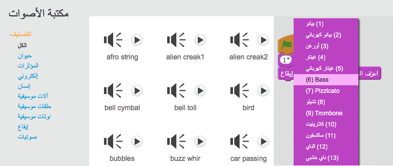
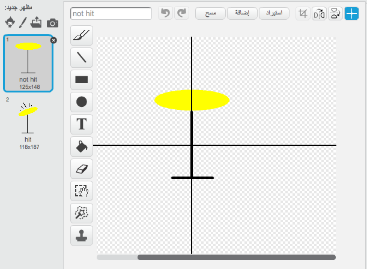

--- challenge ---

## التحدي: إنشاء فرقتك الموسيقية

استخدم ما تعلمتَه في هذا المشروع لابتكار فرقتك الموسيقية! يمكنك إنشاء أي آلات تريدها — ألق نظرة على الآلات والأصوات المتوفرة للحصول على بعض الأفكار.

ليس بالضرورة أن تكون الآلات كما هي في الواقع، فعلى سبيل المثال يمكنك إنشاء بيانو مكوَّن من قطع فطائر مدوَّرة!

فضلا عن استخدام كائنات موجودة مسبقاً، يمكنك أيضا رسم كائنات خاصة بك.

--- collapse ---

## العنوان: لماذا 'يقفز' الكائن عندما يتغير مظهره؟

+ عندما تنشئ كائنًا، ربما تلاحظ أنه عندما تنقر عليه، فإنه 'يقفز' إذا تغير مظهره، يحدث ذلك لأن المظهرين مختلفان في المركز.

لإصلاح هذا الخطأ، انقر فوق **تعيين مركز المظهر** لكلا المظهرين، وتأكد من أن المركز عند النقطة نفسها في كلا المظهرين.

--- /collapse ---

إذا كان لديك ميكروفون، فيمكنك تسجيل أصوات من عندك، بل ويمكنك استخدام كاميرا الويب لتصوير الآلات!

--- /challenge ---