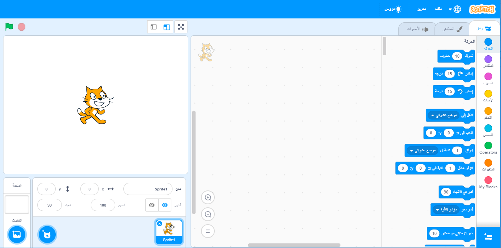
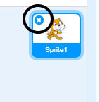
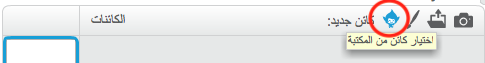
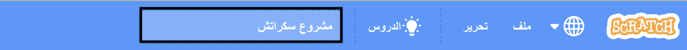
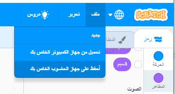

## الكائنات

قبل أن تتمكن من البدء في البرمجة، ستحتاج إلى إضافة 'شيء' لتبرمج. في برنامج Scratch، تسمى هذه "الأشياء" **بالكائنات**.

\--- task \---

افتح مشروع سكراتش (Scratch) جديدًا وفارغًا.

**اتصال بالانترنيت:** افتح مشروع سكراتش Scratch جديد عبر الانترنيت من [rpf.io/scratch-new](http://rpf.io/scratch-new) {:target="_blank"}.

**من دون اتصال انترنيت:** افتح مشروع سكراتش Scratch جديد عبر برنامج المحرر الموجود على جهازك دون اتصال بالانترنيت.

اذا تحتاج تنزيل وتنصيب برنامج السكراتش Scratch على جهازك الشخصي، ستجده في [rpf.io/scratchoff](http://rpf.io/scratchoff){:target="_blank"}.

وهو يبدو بهذا الشكل:

\--- /task \---

\--- task \---

The cat sprite that you can see is the Scratch mascot. You don't need it for this game, so get rid of it by clicking on the X in the corner.

\--- /task \---

\--- task \---

بعد ذلك، **انقر فوق اختيار كائن من المكتبة** لفتح قائمة تحتوي على كل كائنات برنامج Scratch.

\--- /task \---

\--- task \---

مرِّر إلى أسفل إلى أن ترى كائن الطبلة. وانقر فوق الطبلة لإضافتها إلى مشروعك.

\--- /task \---

\--- task \---

انقر واسحب كائن الطبلة الى اسفل المنصة.

\--- /task \---

\--- task \---

أعطي مشروعك إسمً بكتابة الاسم داخل مربع النص في الأعلى.

اضغط على القائمة **ملف** ومن ثم **حفظ الان** لتخزين مشروعك.

اذا لم تكن مرتبط بالانترنيت او لا تملك حساب سكراتش Scratch، بامكانك خزن نسخة من مشروعك على جهازك الخاص بالضغط على **الحفظ الى حاسوبك**.

\--- /task \---