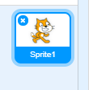
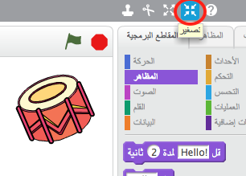

## الكائنات

قبل أن تبدأ البرمجة، ستحتاج إلى إضافة 'شيء' إلى التعليمة البرمجية. وفي برنامج Scratch، تُسمى هذه 'الأشياء' __كائنات__.

+ أولًا، افتح محرر الرسم لبرنامج Scratch. يمكنك العثور على محرر الرسم لبرنامج Scratch عبر الإنترنت على <a href="http://jumpto.cc/scratch-new" target="_blank">jumpto.cc/scratch-new</a>. وهو يبدو بهذا الشكل:

	

+ إن كائن القطة الذي تراه هو شعار برنامج Scratch. لنحذف هذا الكائن بالنقر عليه بزر الماوس الأيمن ثم النقر فوق **حذف**.

	

+ بعد ذلك، انقر فوق **اختيار كائن من المكتبة** لفتح قائمة تحتوي على كل كائنات برنامج Scratch.

	

+ مرِّر إلى أسفل إلى أن ترى كائن الطبلة. وانقر فوق الطبلة، ثم انقر فوق **موافق** لإضافته إلى المشروع.

	

+ انقر فوق أيقونة **تقليص**، ثم انقر فوق الطبلة عدة مرات لتصغيرها.

	

سمِّ برنامجك بكتابة اسم في مربع النص في الزاوية العلوية اليمنى.

يمكنك بعد ذلك النقر فوق **ملف** ثم **حفظ الآن** لحفظ مشروعك. إذا لم يكن لديك حساب على Scratch، فيمكنك أن تحفظ نسخة من مشروعك بالنقر فوق **تنزيل إلى جهازي** بدلًا من ذلك.

