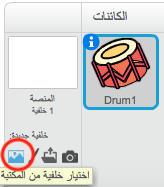
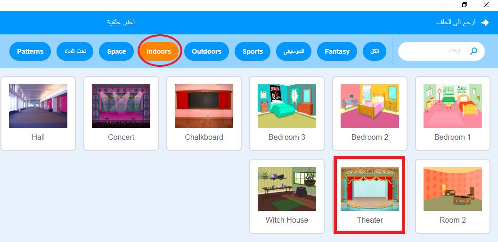
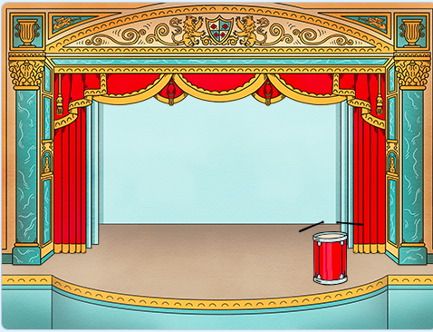

## المنصة

</strong>المنصة** هي المساحة الموجودة على اليمين، وهي المكان الذي يخرج فيه مشروعك للحياة. لذا فكِّر فيها كمساحة للأداء، تمامًا كمنصة مسرح حقيقية!
 

\--- task \---

حالياً، تأخذ المنصة اللون الأبيض وتبدو مملة بعض الشيء! لنضِف خلفية إلى المنصة بالنقر فوق **اختيار خلفية من المكتبة**.

\---/task--

\--- task \---

انقر فوق **داخلي** من القائمة بالاعلى، وثم انقر فوق خلفية منصة مسرح (Theater).

\--- /task \---

\--- task \---

ستكون المنصة كما يلي:

\--- /task \---