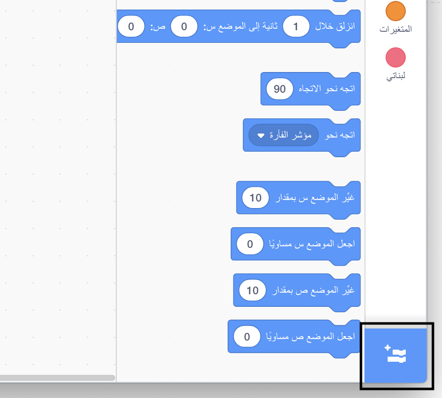
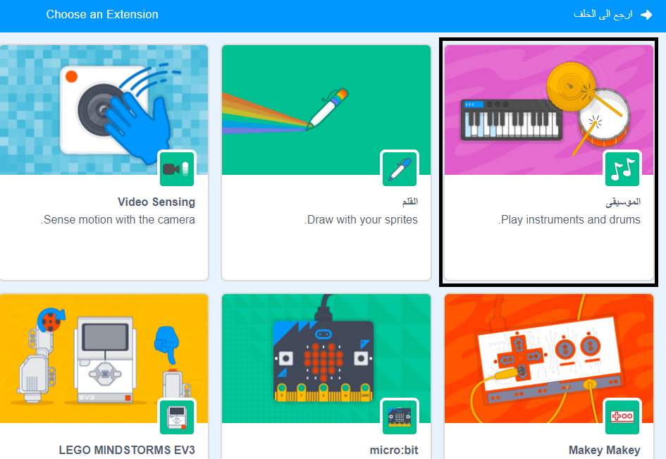
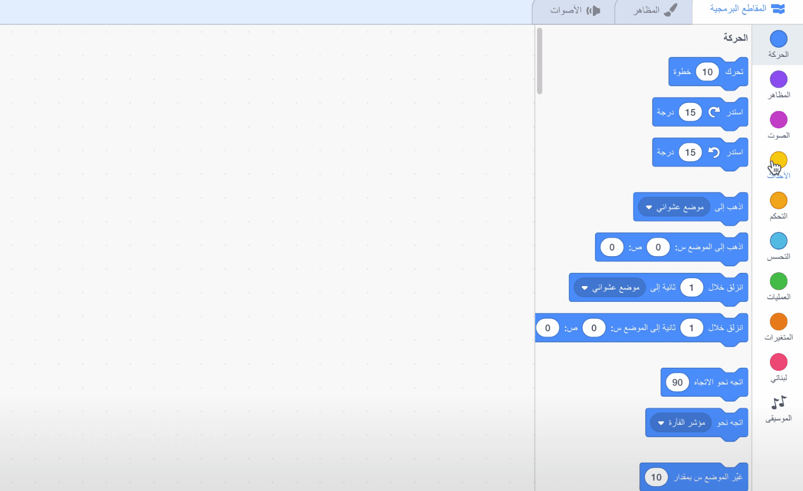

## إنشاء طبلة

الان لنُبرمج الطبلة بحيث تُحدث صوتًا عند النقر عليها.

يمكنك العثور على قوالب التعليمات البرمجية في علامة التبويب المقاطع البرمجية، وكلها مصنفة حسب اللون!

--- task ---

اولا اضف استطالة **الموسيقى** لتتمكن من تشغيل الالات الموسيقية.

اضغط على زر **إدراج إضافة** في الزاوية اليسرى السفلى.



ثم اضغط على **الموسيقى** لاضافتها.



--- /task ---
--- task ---
انقر فوق كائن الطبلة ثم اسحب هاتين الكتلتَين إلى مساحة التعليمات البرمجية الموجودة على اليمين:

```blocks3
when this sprite clicked
play drum (\(1\) Snare Drum v) for (0.25) beats
```

--- no-print ---



--- /no-print ---

تأكد من أن الكتل البرمجية مرتبطتان معًا (كمكعبات لعبة ليغو).

--- /task ---

--- task --- أنقر فوق الطبلة لتجربة اداتك الجديدة! --- /task ---