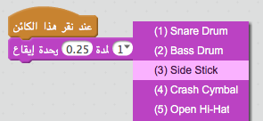
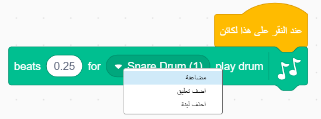

## التحدي: تحسين طبلتك

هل يمكنك تغيير الصوت الذي تُصدره الطبلة عند النقر عليها؟



هل يمكنك أيضًا أن تجعل الطبلة تُصدر صوتًا عند الضغط على مفتاح (المسافة)؟ ستحتاج إلى استخدام قالب `الحدث`{:class="block3events} هذا:

```blocks3
when [المسافة v] key pressed
```

يمكنك نسخ التعليمة البرمجية الحالية بالنقر عليها بزر الماوس الأيمن ثم النقر فوق **مضاعفة**.

