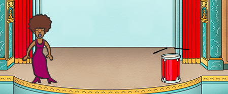
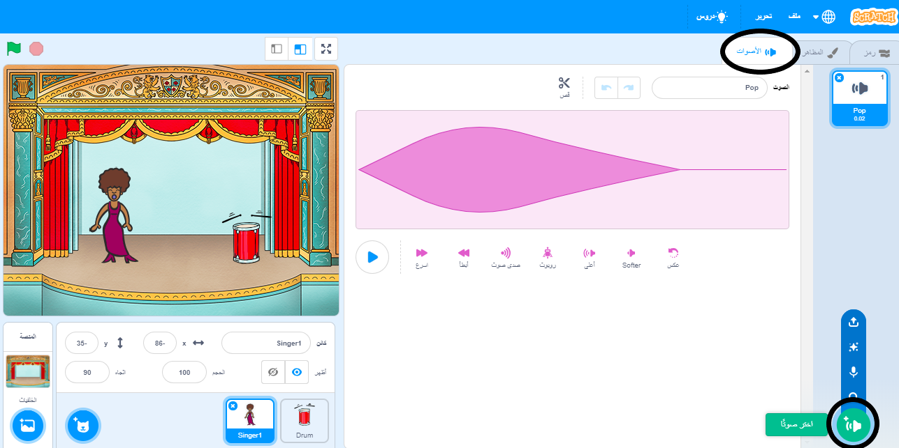
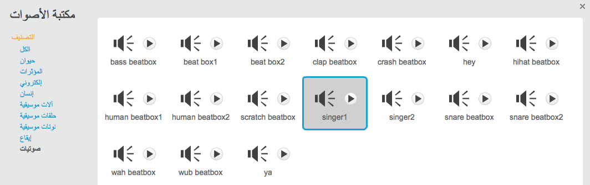

## إنشاء مغنية

والان ستضيف مغنية إلى فرقتك!

--- task ---

أضف كائنَ مغنية إلى منصتك.



[[[generic-scratch3-sprite-from-library]]]

--- /task ---

--- task ---

قبل أن تتمكن من أن تجعل المغنية تغني، ستحتاج إلى إضافة صوت إلى كائن المغنية. تأكد من أنك قمت بتحديد كائن المغنية، وانقر فوق علامة التبويب (الأصوات)، ثم انقر فوق **اختيار صوت من المكتبة**:

 --- /task ---
--- task ---
انقر على قائمة **الاصوات** الموجودة في الاعلى، ثم اختار صوت مناسب لإضافته إلى الكائن.

 --- /task ---
--- task ---
لكي تستخدم الصوت، قم باضافة هذه التعليمة البرمجية إلى كان المغنية:

```blocks3
when this sprite clicked
play sound (singer1 v) until done
```

--- /task ---

انقر على المعنية في المنصة ولاحظ ما يحدث. هل تغني؟