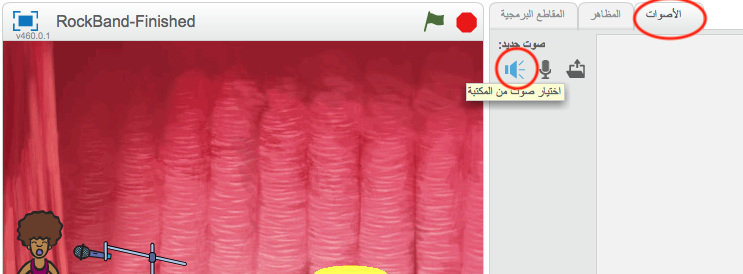

## إنشاء مغنية

لنضِف مغنية إلى فرقتك!

+ أضف كائنَين آخرين إلى المنصة: مغنية وميكروفون.

	

+ قبل أن يمكنك أن تجعل المغنية تغني، ستحتاج إلى إضافة صوت إلى الكائن. تأكد من أنك قمت بتحديد المغنية، وانقر فوق علامة التبويب (الأصوات)، ثم انقر فوق **اختيار صوت من المكتبة**:

	

+ إذا نقرتَ على الفئة **مقاطع غنائية** الموجودة على الجانب الأيمن، فسيمكنك حينها اختيار صوت مناسب لإضافته إلى الكائن.

	

+ بعد أن أضفتَ الصوت الآن، يمكنك إضافة هذه التعليمة البرمجية إلى المغنية:

	```blocks
		عند نقر هذا الكائن
شغل الصوت [singer 1 v] وانتظر انتهاءه
	```

+ انقر فوق المغنية ولاحظ ما يحدث. هل تغني؟
