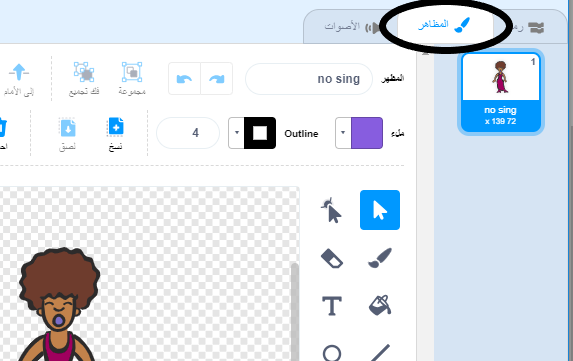
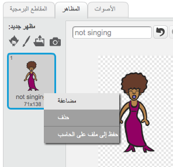
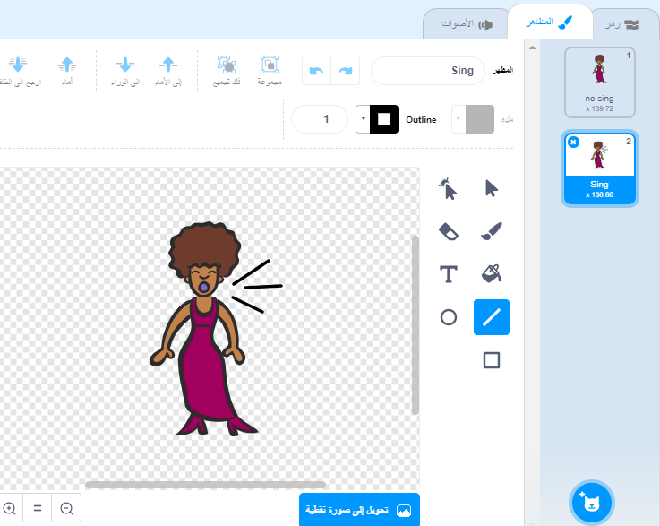
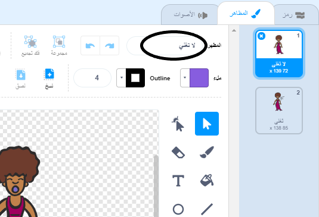
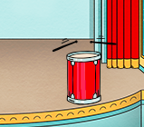

## المظاهر

الان ستجعل من المغنية تبدو كأنها تغني!

\--- task \---

يمكنك تغيير مظهر كائن المغنية عند النقر عليه، وذلك بإنشاء مظهر جديد. انقر فوق علامة التبويب المظاهر، وسترى صورة المغنية.



\---/task--

\--- task \---

انقر بزر الماوس الأيمن على المظهر ثم انقر فوق **مضاعفة** لإنشاء نسخة من المظهر.



\--- /task \---

\--- task \---

انقر فوق المظهر الجديد (المُسمى 'Singer2')، ثم حدِّد أداة الخط و ارسم خطوطًا لتجعل المغنية تبدو وكأنها تغني.



\--- /task \---

\--- task \---

ليست أسماء المظاهر ذات دلالة حقيقية في الوقت الحالي. أعد تسمية المظهرين بحيث يُسمى أحدهما ‘لا تغني’ والآخر ‘تغني’ بكتابة الاسم الجديد لكل مظهر في مربع النص.



\--- /task \---

\--- task \---

بعد أن أصبح لديك الآن مظهران مختلفان للمغنية، يمكنك اختيار المظهر الذي تريد عرضه! أضف هاتين الكتلتَين البرمجيتَين إلى المغنية:

```blocks3
عند النقر على هذا الكائن
+غير المظهر لـ(تغني v)
تشغيل الصوت (singer1 v) وانتظر انتهاءه
+غير المظهر لـ(لاتغني v)

```

يوجد قالب التعليمات البرمجية لتغيير المظهر في قسم `المظاهر`{:class="block3looks"}.

\--- /task \---

\--- task \---

انقر فوق المغنية، هل تبدو وكأنها تغني؟

\--- /task \---

\--- task \---

والان اجعل الطبلة تبدو وكأنها تُدق!



- استخدم تعليمات تغيير مظهر المغنية الموجودة في الخطوة السابقة لمساعدتك.

تذكَّر أن تختبر التعليمة البرمجية الجديدة للتأكد من أنها تعمل بالشكل المطلوب!

\--- /task \---