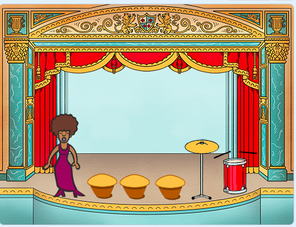
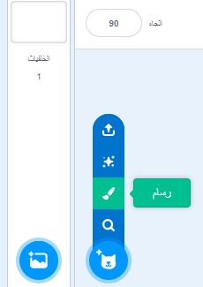
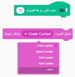

## تحدي: حسّن فرقتك الموسيقية

استخدم ما تعلمتَه في هذا المشروع لابتكار فرقتك الموسيقية. يمكنك إنشاء أي آلات تريدها — ألق نظرة على الآلات والأصوات المتوفرة للحصول على بعض الأفكار.


```blocks3
when this sprite clicked
set instrument to (\(1\) Piano v)
play note (60) for (0.25) beats
```

ليس بالضرورة أن تكون الآلات كما هي في الواقع. فيمكنك مثلًا إنشاء بيانو مكوَّن من قطع فطائر مدوَّرة!



يمكنك رسم كائنات من عندك إلى جانب استخدام الكائنات الموجودة بالمكتبة!



--- collapse ---
---
title: لماذا 'يقفز' الكائن عندما يتغير مظهره؟
---

عندما تنشئ كائنًا، ربما تلاحظ أنه عندما تنقر عليه، فإنه 'يقفز' إذا تغير مظهره، يحدث ذلك لأن المظهرين مختلفان في المركز.

لإصلاح هذا الخطأ، انقر فوق تعيين مركز المظهر لكلا المظهرين، وتأكد من أن المركز عند النقطة نفسها في كلا المظهرين.

--- /collapse ---

إذا كان لديك ميكروفون، فيمكنك تسجيل أصوات من عندك، بل ويمكنك استخدام كاميرا الويب لضرب الآلات!

