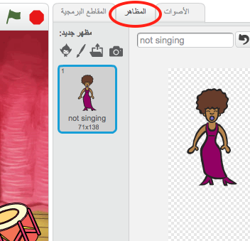
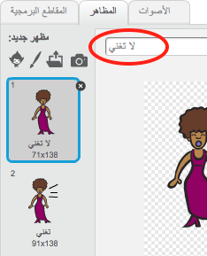
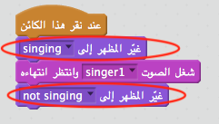

## المظاهر

لنجعل المغنية تبدو وكأنها تغني!

+ يمكنك أيضًا تغيير مظهر كائن المغنية عند النقر عليه، وذلك بإنشاء مظهر جديد. انقر فوق علامة التبويب المظاهر، وسترى صورة المغنية.

	

+ انقر بزر الماوس الأيمن على المظهر ثم انقر فوق **مضاعفة** لإنشاء نسخة من المظهر.

	

+ انقر فوق المظهر الجديد (المُسمى 'Singer2')، ثم حدِّد الأداة خط وارسم خطوطًا لتجعل المغنية تبدو وكأنها تغني.

	

+ ليست أسماء المظاهر ذات دلالة حقيقية في الوقت الحالي. أعد تسمية المظهرين بحيث يُسمى أحدهما 'لا تغني' والآخر 'تغني' بكتابة الاسم الجديد لكل مظهر في مربع النص.

	

+ بعد أن أصبح لديك الآن مظهران مختلفان للمغنية، يمكنك اختيار المظهر الذي تريد عرضه! أضف هاتين الكتلتَين البرمجيتَين إلى المغنية:

	

	يوجد قالب التعليمات البرمجية لتغيير المظهر في قسم `المظاهر`{:class="blocklooks"}.

+ انقر فوق المغنية. هل تبدو وكأنها تغني؟
