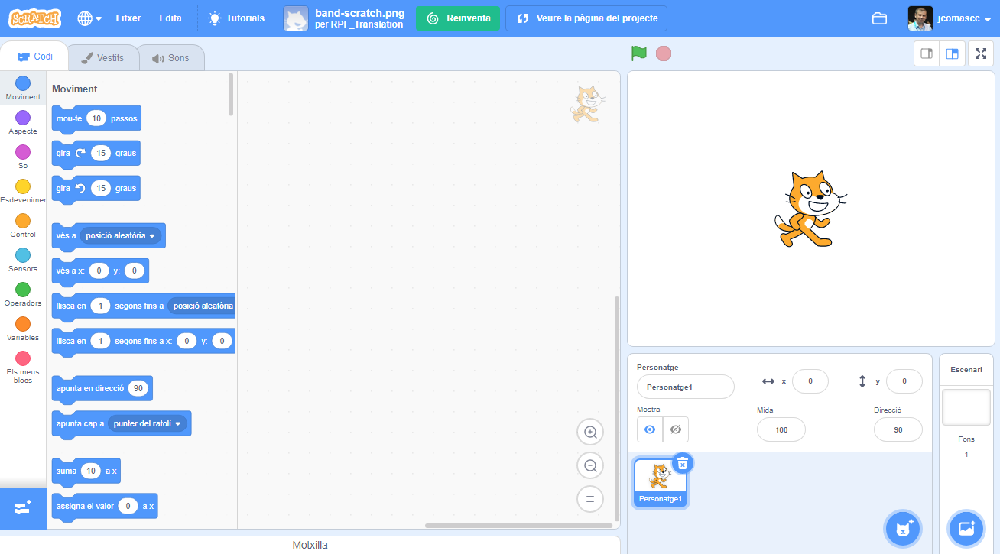
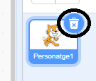
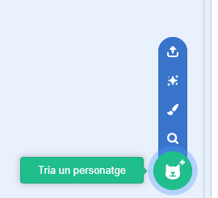
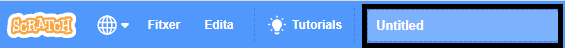
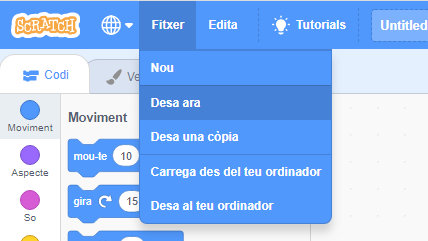

## Personatges

Abans de començar a programar, necessitaràs afegir una 'cosa' al codi. A Scratch, aquestes 'coses' s'anomenen **personatges**.

--- task ---

Crea un projecte nou de Scratch.

**En línia:** obre un projecte d'Scratch nou en línia a [rpf.io/scratch-new](http://rpf.io/scratch-new){:target="_blank"}.

**Fora de línia:** obre un projecte nou a l’editor fora de línia.

Si necessites descarregar i instal·lar l'editor fora de línia de Scratch, el pots trobar a [rpf.io/scratchoff](http://rpf.io/scratchoff){:target="_blank"}.

S'assembla a això:

--- /task ---

--- task ---

El personatge del gat que veus és la mascota de Scratch. No la necessites per aquest joc, per tant, elimina'l fent clic sobre ell amb el botó dret del ratolí i després clicant sobre l'opció **esborra**, o també el pots eliminar clicant amb el botó esquerra del ratolí directament sobre la creu del personatge.

--- /task ---

--- task ---

A continuació, fes clic a **Tria un personatge de la biblioteca** per obrir una llista de tots els personatges de Scratch.

--- /task ---

--- task ---

Desplaça't cap avall fins que vegis el personatge del tambor. Fes clic a un tambor per afegir-lo al teu projecte.

--- /task ---

--- task ---

Fes clic i arrossega el tambor fins a la part inferior de l'Escenari.

--- /task ---

--- task ---

Posa un nom al teu programa escrivint en el quadre de text de la part superior.

A continuació, fes clic a **Fitxer** i després a **Desa ara** per guardar el teu projecte.

Si no estàs en línia o no tens un compte de Scratch, pots desar una còpia del projecte fent clic a **Desa al teu ordinador** com alternativa.

--- /task ---