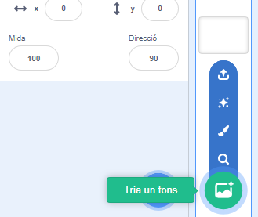

## L'escenari

**L'escenari** es troba a la zona de la dreta, i és on cobra vida el teu projecte. Pensa en això com una àrea d’actuació, igual que un escenari real!

\--- task \---

De moment, l'escenari és blanc i sembla molt avorrit. Afegeix-hi un fons fent clic a **Tria un fons**.

\--- /task \---

\--- task \---

Fes clic a **Interiors** de la llista de la part superior. A continuació, fes clic a un fons de teatre.

\--- /task \---

\--- task \---

Click and drag the drum to the bottom of the Stage.

\--- /task \---

\--- task \---

Your stage should now look similar to this:

\--- /task \---