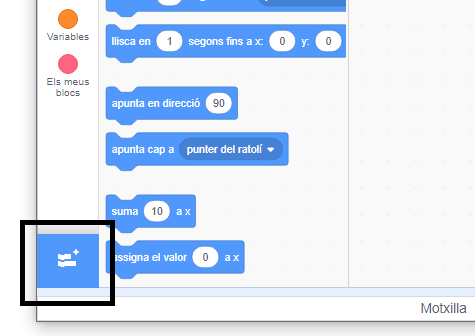
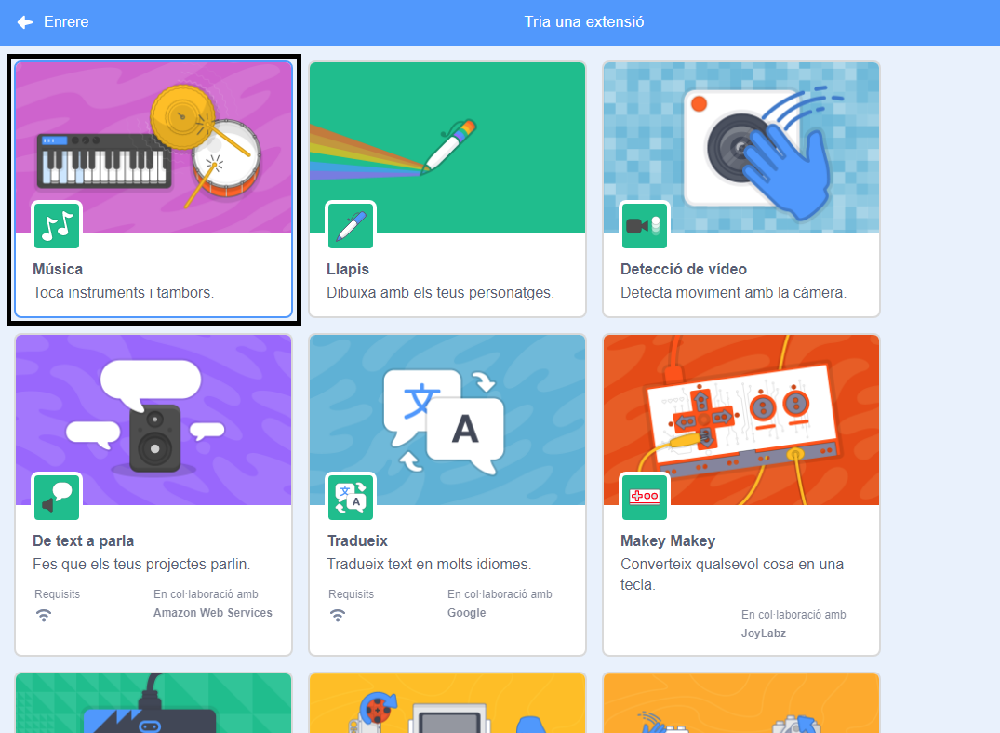
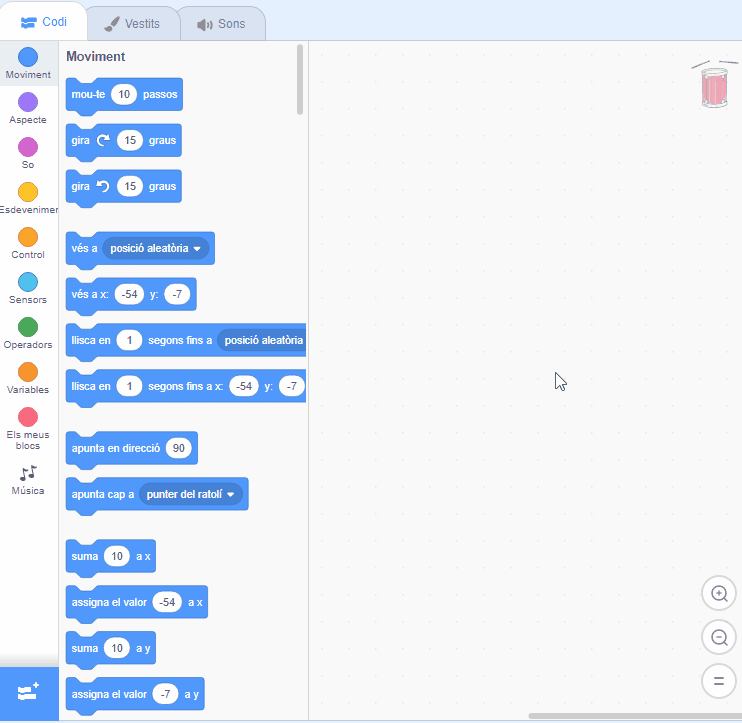

## Fent un tambor

Ara afegiràs codi al teu tambor perquè aquest soni quan hi cliquis a sobre.

Pots trobar els blocs de codi a la pestanya Codi, i tots tenen codis de colors!

\--- task \---

Primer afegeix l'extensió **Música** perquè puguis tocar instruments.

Fes clic al botó **Afegeix una Extensió** de la part inferior esquerra.



Fes clic a l’extensió **Música** per afegir-la.



\--- /task \---

\--- task \---

Fes clic al personatge del tambor i després arrossega aquests dos blocs a l'àrea de codi de la dreta:

```blocks3
when this sprite clicked
play drum (\(1\) Snare Drum v) for (0.25) beats
```

\--- no-print \---



\--- /no-print \---

Assegura't que els blocs estiguin connectats entre sí (com els maons de LEGO).

\--- /task \---

\--- task \---

Fes clic al tambor per provar el teu nou instrument!

\--- /task \---