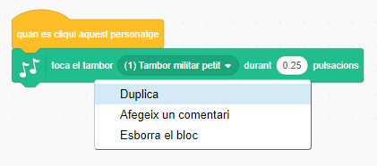

## Repte: millora el teu tambor

Pots canviar el so que fa el tambor quan el cliques?


També pots aconseguir que el tambor soni quan es prem la barra d’espai? Hauràs d’utilitzar aquest bloc `esdeveniment`{:class="block3events"}:

```blocks3
when [space v] key pressed
```

Si vols copiar el codi existent, fes clic amb el botó dret a sobre i, a continuació, fes clic a **Duplica**.

