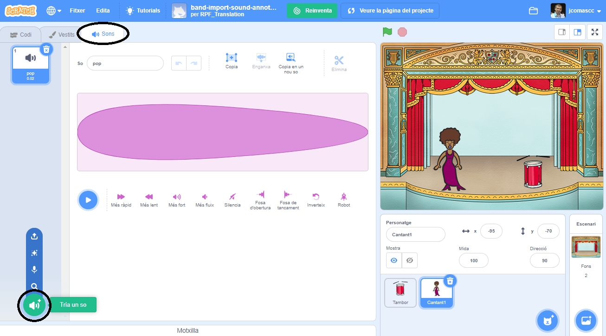
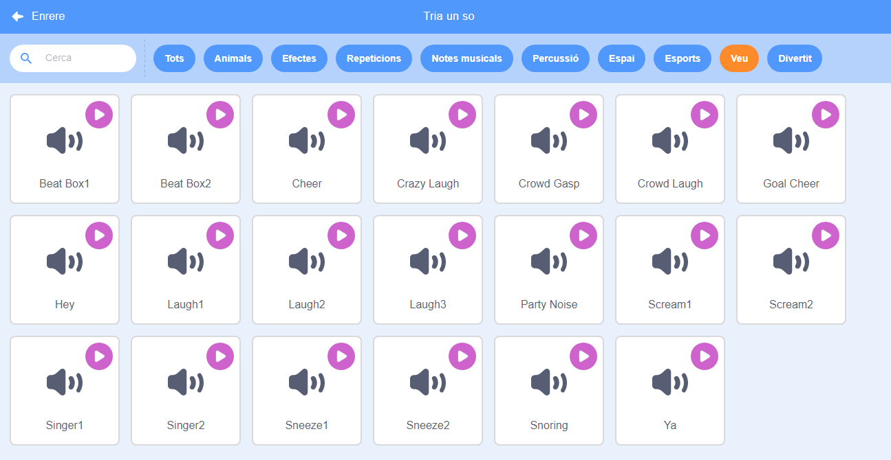

## Fent un cantant

Ara afegiràs un cantant a la teva banda!

--- task ---

Afegeix un personatge de cantant a l'Escenari.


[[[generic-scratch3-sprite-from-library]]]

--- /task ---

--- task ---

Abans que puguis fer cantar el teu cantant, has d'afegir un so al seu personatge. Assegura't que has seleccionat el teu personatge de cantant, a continuació, fes clic a la pestanya Sons i fes clic a **Tria un so**:



--- /task ---

--- task ---

Fes clic a **Veu** a la llista de la part superior i, a continuació, escull un so per afegir-lo al teu personatge.



--- /task ---

--- task ---

Per utilitzar el so, afegeix els blocs de codi següents al teu personatge de cantant:

```blocks3
when this sprite clicked
play sound (singer1 v) until done
```

--- /task ---

--- task ---

Fes clic al cantant a l'escenari i mira què passa. Canta?

--- /task ---