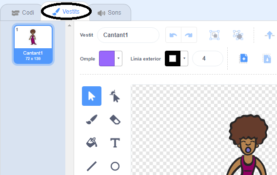
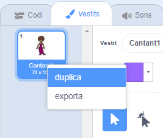
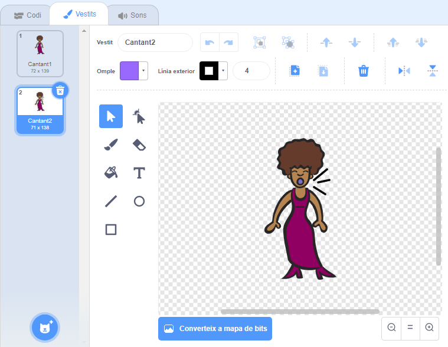
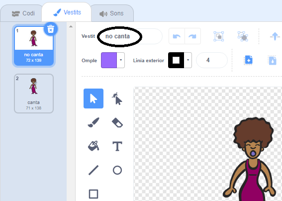

## Vestits

Ara faràs que el teu cantant sembli que canti!

--- task ---

Pots canviar l’aspecte del teu personatge de cantant quan se'l cliqui assignant-li un nou vestit. Fes clic a la pestanya Vestits i veuràs el vestit del cantant.



--- /task ---

--- task ---

Fes clic amb el botó dret al vestit i després clic a **duplica** per crear-ne una còpia.



--- /task ---

--- task ---

Fes clic al vestit nou (anomenat "Cantant2") i, a continuació, selecciona l'eina de línia i dibuixa línies perquè sembli que el teu cantant canta.



--- /task ---

--- task ---

De moment, els noms dels vestits no són de gran ajuda. Escriu dins els requadres de text dels vestits per canviar el seu nom per "no canta" i "canta".



--- /task ---

--- task ---

Ara que tens dos vestits diferents pel teu cantant, pots triar el vestuari que es mostra! Afegeix aquests dos blocs de codi al personatge del teu cantant:

```blocks3
when this sprite clicked
+switch costume to (canta v)
play sound (singer1 v) until done
+switch costume to (no canta v)
```

El bloc de codi per canviar el vestit es troba a la secció `Aspecte`{:class="block3looks"}.

--- /task ---

--- task ---

Fes clic al teu cantant de l'escenari. Sembla que està cantant?

--- /task ---

--- task ---

Ara fes que el tambor sembli que s'està colpejant!


- Segueix les instruccions per canviar el vestit del personatge del cant per ajudar-te.

No oblidis provar que el teu codi nou funciona!

--- /task ---