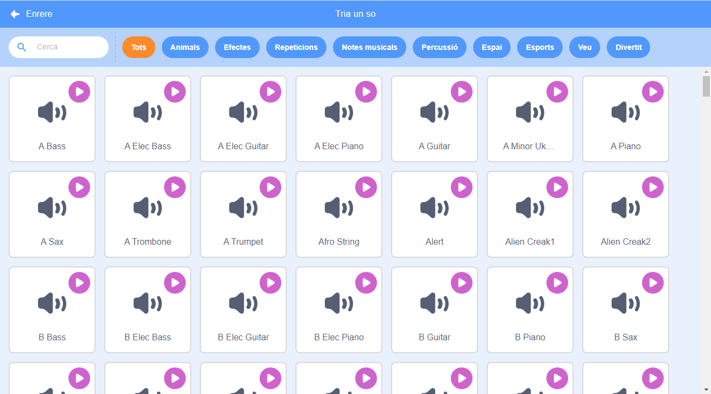
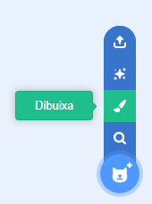
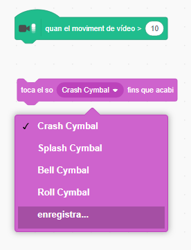

## Repte: millora la teva banda

Fes servir el que has après en aquest projecte per fer la teva pròpia banda! Pots crear qualsevol instrument que t'agradi — mira els personatges d'instruments i sons disponibles per obtenir-ne idees.



```blocks3
when this sprite clicked
set instrument to (\(1\) Piano v)
play note (60) for (0.25) beats
```

Però els teus instruments no cal que siguin realistes. Per exemple, podries fer un piano fet amb magdalenes!


Pots utilitzar més personatges de la biblioteca i també pots pintar els teus propis personatges!



--- collapse ---
---
title: Per què el meu personatge 'salta' quan canvia de vestit?
---

Quan crees el teu propi personatge, potser trobaràs que quan facis clic al personatge, "salta" a mesura que canvia de vestit. Això passa perquè els dos vestits no estan centrats en el mateix lloc.

Per solucionar-ho, assegura't que els centres dels vestits del teu personatge siguin els mateixos.

--- /collapse ---

Si tens un micròfon, pots gravar els teus propis sons, i fins i tot pots utilitzar una càmera web per tocar els teus instruments!

