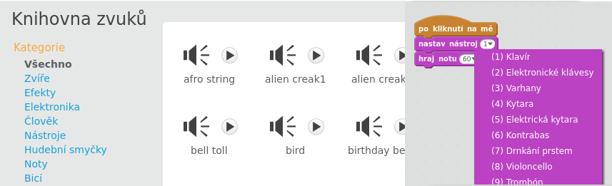
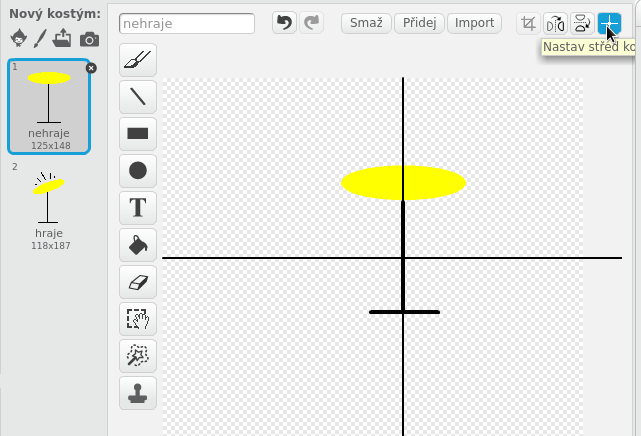
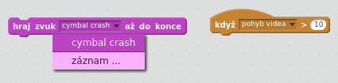

\--- challenge \---

## Výzva: Vytvoř si svou vlastní skupinu

Využij toho, co jsi se naučil/a v tomto projektu, a vytvoři vlastní skupinu! Můžeš si vytvořit všechny nástroje, které se ti líbí - podívej se na dostupné zvuky a nástroje, abys získal/a nějaké nápady.

Tvoje nástroje určitě nemusí být rozumné. Můžeš například udělat klavír vyrobený z muffinů!

Můžeš používat připravené postavy z knihovny, můžeš si ovšem také nakreslit vlastní.

## \--- collapse \---

## title: Proč postava 'skáče', když se změní kostým?

+ Při vytváření vlastního kostýmy se může stát, že postava "skáče", když se změní kostým. Je to proto, že oba kostýmy nejsou stejně umístěné.

Chceš-li to opravit, klikni na tlačítko **Nastavit střed kostýmu** a ujisti se, že u obou kostýmů je střed ve stejném místě.

\--- /collapse \---

Pokud máš mikrofon, můžeš nahrávat své vlastní zvuky. Můžeš dokonce použít webovou kameru k aktivaci nástrojů!

\--- /challenge \---