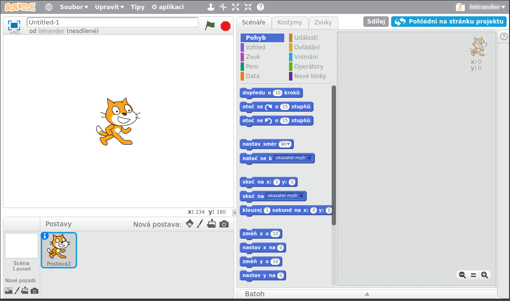
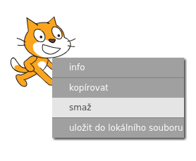
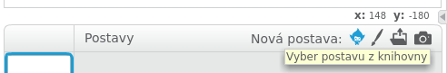
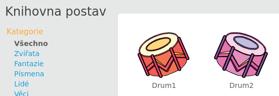
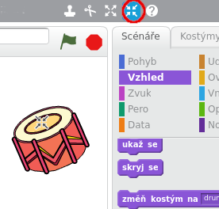
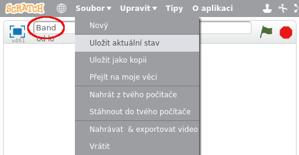

## Sprajty

Než začneš kódovat, musíš přidat do kódu různé viditelné 'prvky'. V aplikaci Scratch se tyto "prvky" nazývají ** sprajty **.

+ Nejdříve otevři editor Scratch. Online editor Scratch najdeš na adrese <a href="http://jumpto.cc/scratch-new" target="_blank"> jumpto.cc/scratch-new </a>. Vypadá takto:
    
    

+ Sprajt kočky, který vidíš, je maskot Scratche. Pojďme ho smazat, pravým tlačítkem myši klikni na Scratche a z menu vyber položku **smazat**.
    
    

+ Dále klikni na obrázek panáčka, kontextová nápověda je **Vybrat postavu z knihovny**, a otevři seznam všech sprajtů ve Scratchi.
    
    

+ Přejdi dolů, dokud neuvidíš bubínek. Klikněte na něj a pak klikni na tlačítko **OK** abys ho přidal do projektu.
    
    

+ Klikni na ikonu šipek směřujících dovnitř představující funkci **Zmenši**, pak několikrát klikni na buben, aby se zmenšil.
    
    

Dej programu vlastní názvem. Uděláš to tak, že ho zadáš do textového pole v levém horním rohu.

Pak můžete klepnout na položku menu **Soubor** vybrat **Uložit aktuální stav** a uložit tak svůj projekt. Pokud nemáš účet Scratch, můžeš si místo toho uložit kopii projektu kliknutím na položku **Stáhnout do tvého počítače**.

