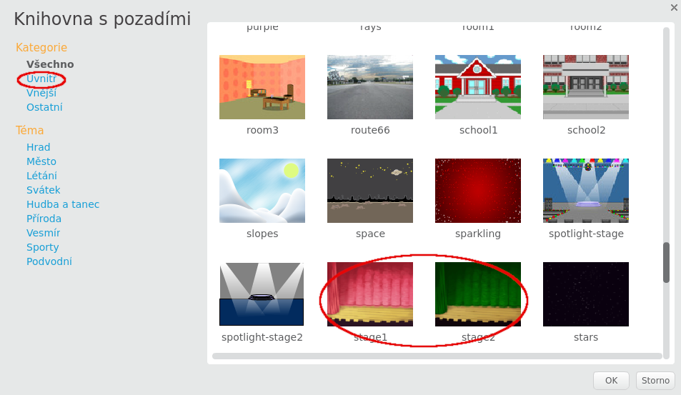

## Jeviště

**Jeviště** je oblast vlevo a je to místo, kde tvůj projekt ožívá. Přemýšlej o tom jako o oblasti představení, stejně jako o skutečné jevištní scéně!

+ V tuto chvíli je scéna bílá a vypadá docela nudně! Přidej na ní pozadí, uděláš to kliknutím na **Vyber pozadí z knihovny**.
    
    

+ Klikni vlevo na položku **Uvnitř** a potom klikni na pozadí které chceš vybrat a vše potvrď tlačítkem **OK**.
    
    

+ Mělo by to nakonec vypadat takto:
    
    