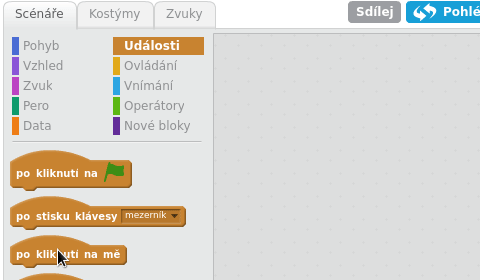

## Vytvoření bubnu

Pojďme vytvořit kód pro buben tak, aby vydal zvuk, když do něj "udeříš".

Bloky pro tvorbu kódu najdeš na kartě Scénáře a všechny jsou podle funkce rozlišeny barevně!

+ Klikni na buben a poté přetáhni tyto dva bloky do oblasti kódu napravo. Ujisti se, že jsou spojeny dohromady (jako Lego bloky):

+ Klikni na buben a vyzkoušejte nový nástroj!