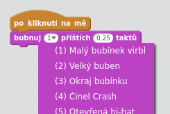
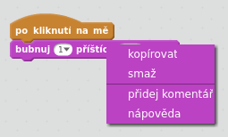

## Výzva: vylepšení bubnu

Dokážeš změnit zvuk, který buben dělá po kliknutí?



Can you also get the drum to make a sound when the space bar is pressed? You'll need to use this `event`{:class="block3events"} block:

```blocks3
po stisku klávesy [mezerník v]
```

If you want to copy your existing code, right-click on it and then click on **duplicate**.

