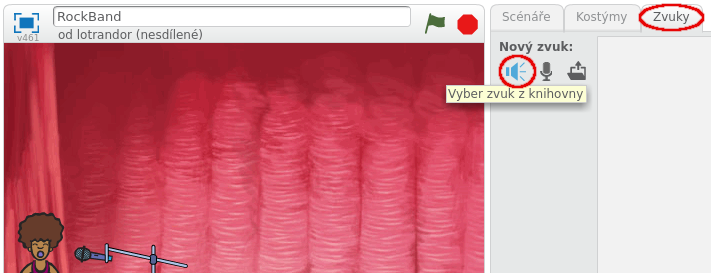
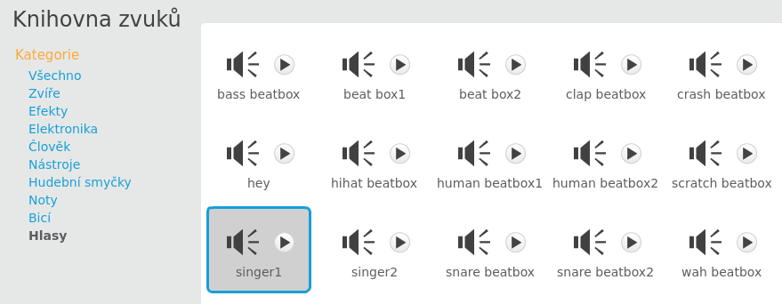

## Přidání zpěvačky

Přidejme do kapely zpěvačku!

+ Přidej ke scéně další dvě postavy: zpěvačku a mikrofon.
    
    

+ Pro zpěvačku budeš potřebovat vhodný zvuk s jejím zpěvem, který musíš přidat k její postavě. Ujisti se, že máš vybranou zpěvačku, klikni na kartu Zvuky a pak na tlačítko reproduktoru **Vyber zvuk z knihovny**:
    
    

+ Když na levé straně vybereš kategorie **Hlasy**, zuží se výběr na vhodné zvuky pro zpěv.
    
    

+ Nyní, když jsi zvuk přidal, můžeš přidat zpěvačce přidat tento kousek kódu:
    
    ```blocks
        when this sprite clicked
        play sound [singer1 v] until done
    ```

+ Klikni na zpěvačku a poslouchej, co se stane. Zpívá?