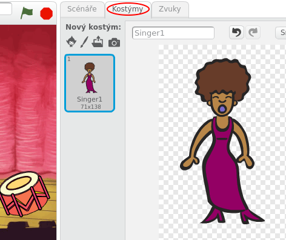
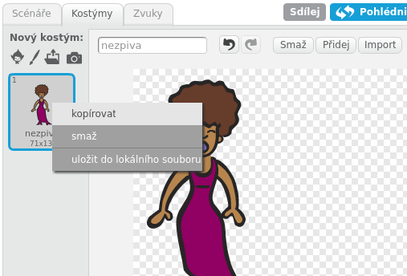
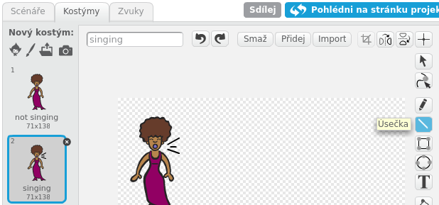
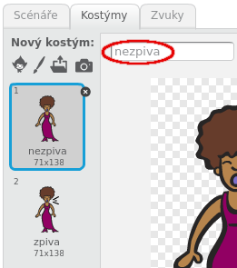
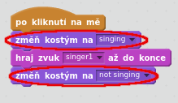

## Kostýmy

Pojďme udělat, aby zpěvačka vypadala, jako že zpívá!

+ Můžeš změnit vzhled zpěvačky, jak bude vypadat, když na ní klikneš a ona začne zpívat. Uděláš to tak, že jí vytvoříš nový kostým. Klikni na kartu kostýmy, a zobrazí se vám vzhled zpěvačky.
    
    

+ Klikni pravým tlačítkem myši na kostým a vyber položku **kopírovat**. Vytvoříš tak kopii kostýmu.
    
    

+ Klůikni na nový kostým (má název "Singer2") a pak pomocí nástroje čára nakreslit čáry tak, aby to vypadalo jako zpěvačka zpívá.
    
    

+ Názvy kostýmů nejsou v tuto chvíli příliš vypovídající. Přejmenuj oba kostýmy přepsáním existujících názvů v textovém poli. Zvol názvy, které ti pomohou v orientaci v kostýmech.
    
    

+ Nyní, když máš pro zpěvačku dva různé kostýmy, můžeš si vybrat, který kostým se zobrazí! Přidejte tyto dva bloky k zpěvákovi:
    
    
    
    Blok kódu pro změnu kostým je v kategorii `Vzhled` {: class = "blocklooks"}.

+ Klikni na zpěváka. Vypadá to, že zpívá?