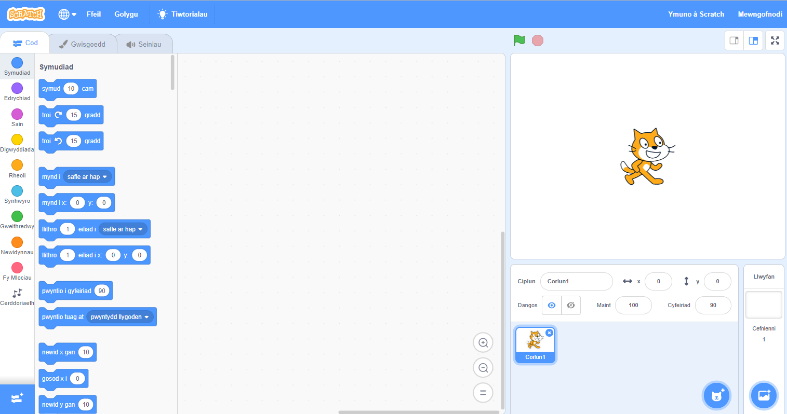
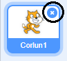
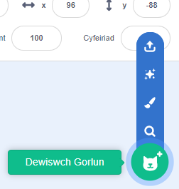

## Corluniau

Cyn i ti allu dechrau codio, bydd angen i ti ychwanegu ‘rhywbeth’ i godio. Yn Scratch, mae’r ‘pethau’ yma yn cael eu galw yn **gipluniau**.

\--- task \---

Open a new Scratch project.

**Online:** open a new online Scratch project at [rpf.io/scratch-new](http://rpf.io/scratch-new){:target="_blank"}.

**Offline:** open a new project in the offline editor.

If you need to download and install the Scratch offline editor, you can find it at [rpf.io/scratchoff](http://rpf.io/scratchoff){:target="_blank"}.

It looks like this:

\--- /task \---

\--- task \---

The cat sprite that you can see is the Scratch mascot. You don't need it for this game, so get rid of it by clicking on the X in the corner.

\--- /task \---

\--- task \---

Next, click on **Choose sprite from library** to open up a list of all the Scratch sprites.

\--- /task \---

\--- task \---

Scroll down until you see a drum sprite. Click on a drum to add it to your project.

\--- /task \---

\--- task \---

If you are signed in to your Scratch account, type the title of your project into the project title box at the top of the screen:

**Tip:** Give your projects helpful names so that you can easily find them when you have lots of projects.

Next, click on File, and then on Save now to save your project.

If you are not online or don't have a Scratch account, you can save a copy of your project by clicking on **Save to your computer** instead.

\--- /task \---