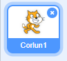

## Cipluniau

Cyn i ti allu dechrau codio, bydd angen i ti ychwanegu 'rhywbeth' i godio. Yn Scratch, mae'r 'pethau' yma yn cael eu galw yn _giplun_.

+ Yn gyntaf, agora teclyn golygu Scratch. Mae modd dod o hyd i'r teclyn golygu Scratch arlein yma <a href="http://jumpto.cc/scratch-new" target="_blank">jumpto.cc/scratch-new</a>. Mae'n edrych fel hyn:

	

+ Masgot Scratch yw'r ciplun o'r gath y gweli di ar y sgrin. Dere i ni gael gwared ohono, trwy glicio ar y dde a gwasgu 'dileu'.

	

+ Nesaf, clicia 'Dewis ciplun o'r rhestr' i agor yr holl restr o gipluniau Scratch.

	

+ Cer i waelod y rhestr trwy sgrolio tan dy fod yn gweld ciplun o ddrwm. Clicia ar y drwm a gwasga 'Iawn' i'w ychwanegu i dy brosiect.

	

+ Clicia'r botwm 'lleihau', ac yna clicia ar y drwm cwpwl o weithiau i'w wneud yn llai.

	

Rho enw i dy brosiect, gan deipio un i'r blwch testun yn y gornel dop ar y chwith.

Clicia 'Ffeil' ac 'Arbed nawr' i gadw dy brosiect.

(Os nad oes gen ti gyfrif Scratch, galli di arbed copi o dy brosiect trwy ddewis 'Llwytho i'r cyfrifiadur' yn lle).
