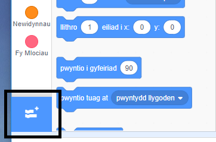
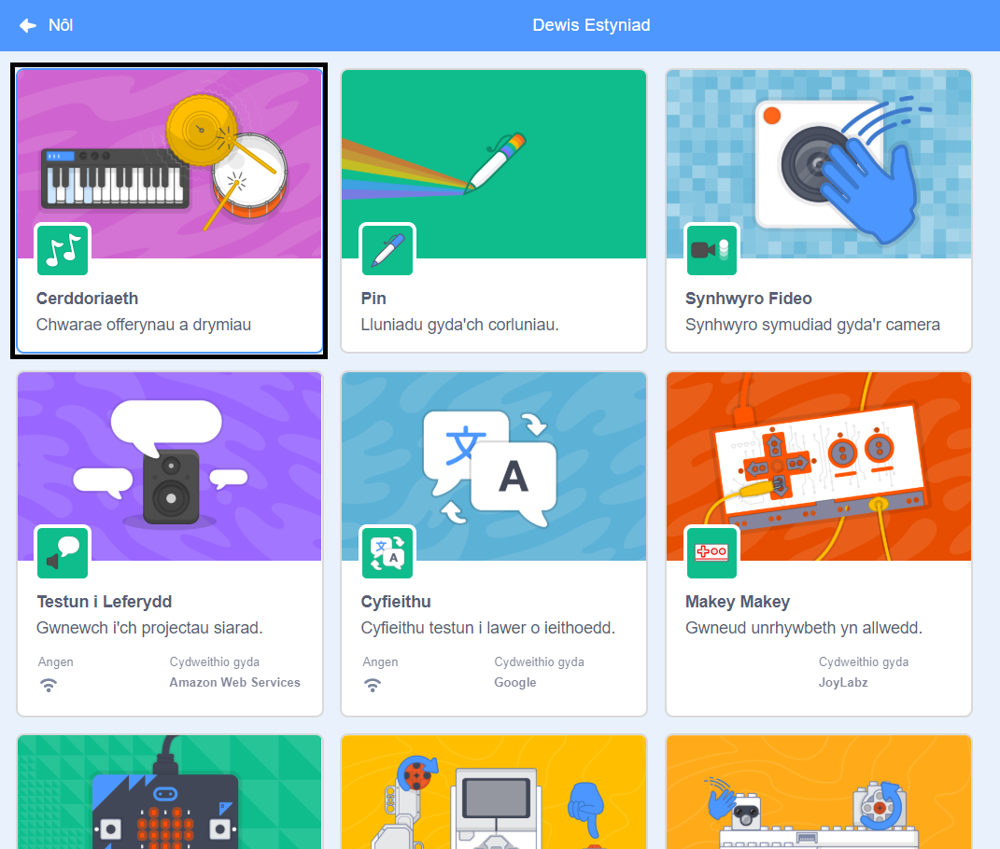
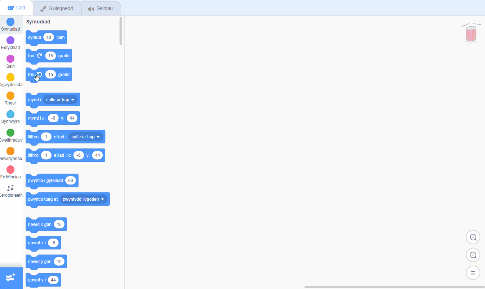

## Creu drwm

Byddi di nawr yn ychwanegu côd i dy ddrwm i wneud sŵn pan mae'n cael ei glicio.

Fe ddei di o hyd i’r blociau côd yn y tab Côd, ac mae gan bob un ei liw ei hunan!

\--- task \---

Chwilia am yr estyniad **Cerddoriaeth** fel dy fod yn gallu chwarae offerynau.

Clicia'r botwm **Ychwanegu Estyniad** yng ngwaelod-chwith y dudalen.



Clicia'r estyniad **Cerddoriaeth** i'w ychwanegu.



\--- /task \---

\--- task \--- Clicia ar y corlun drwm, yna llusga’r ddau floc yma i’r ardal codio ar y dde:

\--- no-print \---



\--- /no-print \---

\--- print-only \---

```blocks3
pan gaiff y ciplun yma ei glicio
chwarae drwm ((1) Drwm Gwifrau v) am (0.25) curiad
```

\--- /print-only \---

Gwna'n siwr fod y blociau wedi cysylltu â'i gilydd (fel blociau Lego).

\--- /task \---

\--- task \--- Clicia y drwm i drio dy offeryn newydd! \--- /task \---