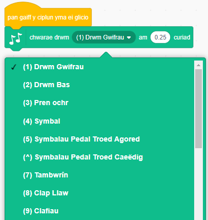
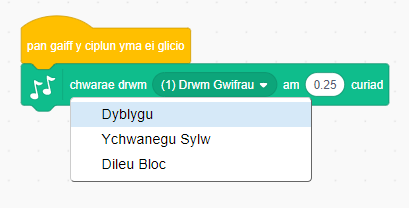

## Her: Perffeithio dy ddrwm

Alli di newid y sŵn mae’r drwm yn ei wneud pan mae’n cael ei glicio?



Alli di hefyd wneud i’r drwm wneud sŵn wrth wasgu’r bylchwr ar yr allweddell? Bydd angen i ti ddefnyddio’r bloc `digwyddiadau`{:class="block3events"}:

```blocks3
when [bwlch v] key pressed
```

Mae modd i ti arbed y côd gyda clic-dde a dewis **dyblygu**.

