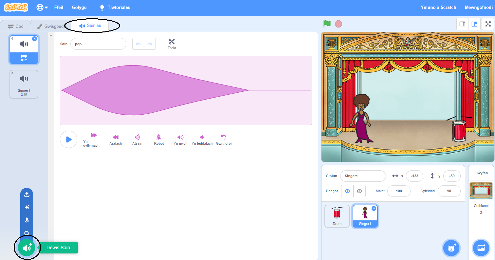
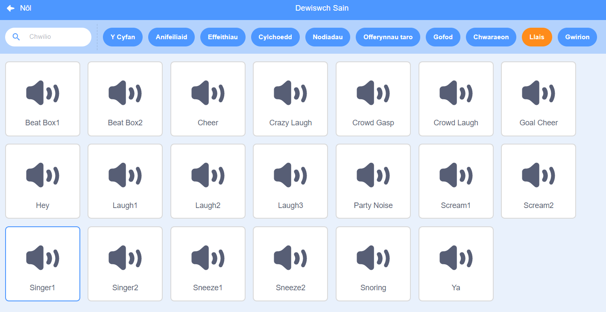

## Creu canwr

Rwyt ti nawr am ychwanegu canwr i dy fand!

--- task ---

Ychwanega gorlun canwr i dy Lwyfan.


[[[generic-scratch3-sprite-from-library]]]

--- /task ---

--- task ---

Cyn i ti allu wneud i dy ganwr ganu, bydd angen i ti ychwanegu sain i dy gorlun. Gwna'n siwr dy fod wedi dewis dy ganwr, yna clicia ar y tab Seiniau a **Dewis Sain**:

 --- /task ---

--- task --- Clicia **Llais** ar y top, yna dewisa sain i ychwanegu i dy gorlun.

 --- /task ---

--- task --- I ddefnyddio'r sain, ychwanega'r blociau canlynol i gorlun y canwr:

```blocks3
pan gaiff y ciplun yma ei glicio
chwarae sain (Singer1 v) tan y diwedd
```

--- /task ---

--- task --- Clicia dy ganwr ar y llwyfan a gweld beth sy'n digwydd. Ydy hi'n canu? --- /task ---