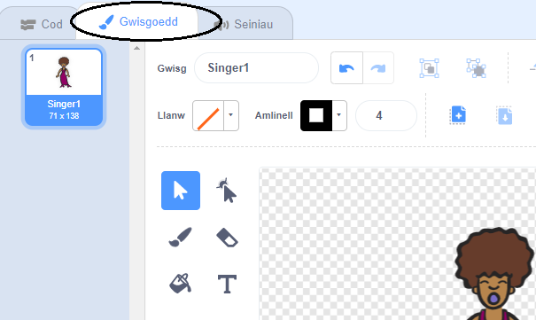
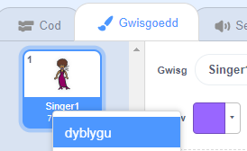
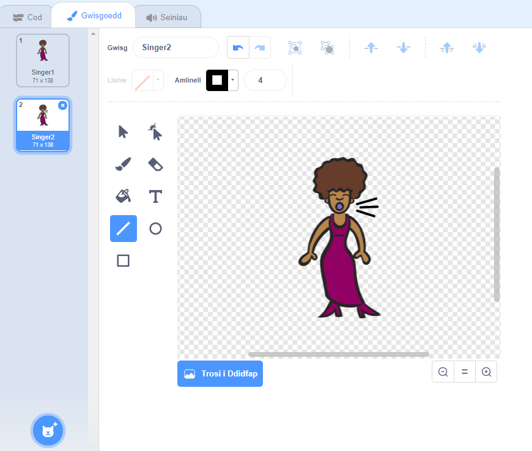
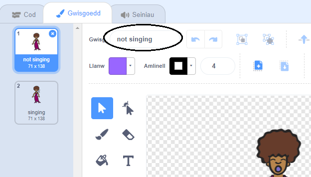

## Gwisgoedd

Nawr rwyt ti am wneud i dy ganwr edrych fel ei bod yn canu!

--- task ---

Galli di newid sut mae corlun dy ganwr yn edrych trwy greu gwisg newydd. Dewisa’r tab Gwisgoedd, ac fe weli di lun o wisg y canwr.



--- /task ---

--- task ---
Dewisa clic-dde ar y wisg, a clicia **dyblygu** i greu copi o’r wisg.



--- /task ---

--- task ---

Clicia ar y wisg newydd (‘Singer2’) a dewisa y teclyn llinell i wneud iddi edrych fel bod sain yn dod o geg y canwr.



--- /task ---

--- task ---

Dyw enwau’r gwisgoedd ddim yn llawer o gymorth ar hyn o bryd. Teipia yn y blwch testun ‘ddim yn canu’ ac ‘yn canu’ i wahaniaethu rhwng y ddau.



--- /task ---

--- task ---

Nawr bod gyda ti ddau wisg gwahanol i dy ganwr, galli di ddewis pa wisg sydd yn cael ei arddangos! Ychwanega y ddau floc yma i gorlun dy ganwr:

```blocks3
when this sprite clicked
+switch costume to (yn canu v)
play sound (Singer1 v) until done
+switch costume to (ddim yn canu v)
```

Mae’r côd ar gyfer newid y wisg yn yr adran `Edrychiad`{:class="block3looks"}.

--- /task ---

--- task ---

Clicia dy ganwr ar y llwyfan. Ydy e'n edrych fel ei bod hi'n canu?

--- /task ---

--- task ---

Nawr gwna i dy ddrwm edrych fel ei fod yn cael ei daro!


- Defnyddia'r cyfarwyddiadau i newid gwisg dy ganwr i fod o gymorth i ti.

Cofia brofi fod dy gôd newydd yn gweithio!

--- /task ---
