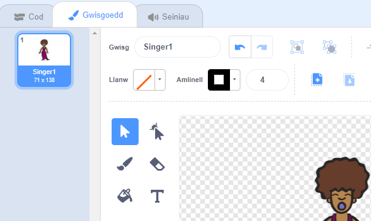
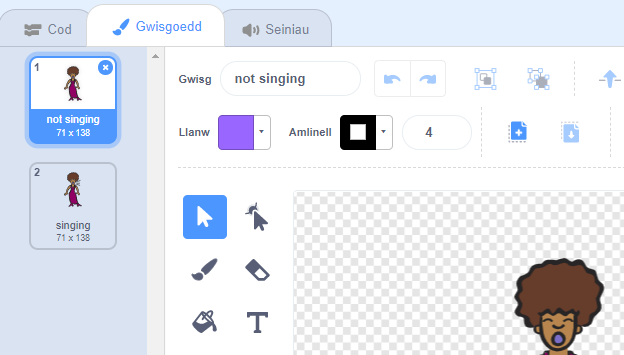

## Gwisgoedd

Ewn ati i wneud dy ganwr i edrych fel ei bod yn canu!

+ Galli di hefyd newid sut mae ciplun dy ganwr yn edrych trwy greu gwisg newydd. Dewisa'r tab 'Gwisgoedd', ac fe weli di lun o'r canwr.

	

+ Dewisa clic-dde ar y wisg, a clicia 'dyblygu' i greu copi o'r wisg.

	

+ Clicia ar y wisg newydd (o'r enw 'Singer2') a dewisa y teclyn llinell i lunio llinellau i wneud hi edrych fel bod y canwr yn gwneud sŵn.

	

+ Nid yw enwau'r gwisgoedd yn llawer o gymorth ar hyn o bryd. Ail-enwa y 2 wisg i 'ddim yn canu' ac 'yn canu' wrth deipio enw newydd pob gwisg yn y blwch testun.

	

+ Nawr bod gyda ti 2 wisg gwahanol i dy ganwr, galli di ddewis pa wisg sydd yn cael ei arddangos! Ychwanega y 2 floc yma i dy ganwr:

	

	Mae'r côd ar gyfer newid y wisg yn yr adran `Edrychiad`{:class="blocklooks"}.

+ Profa dy ganwr.  Pan wyt ti yn clicio arni, fe ddylai dy ganwr edrych fel ei bod yn canu!
