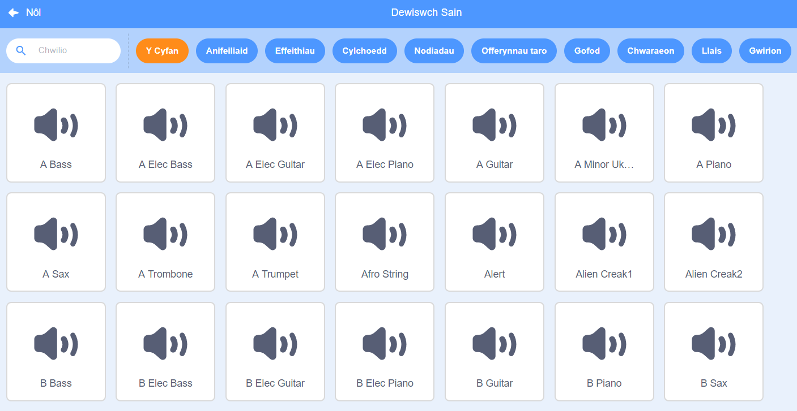
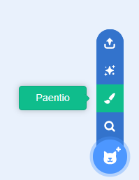
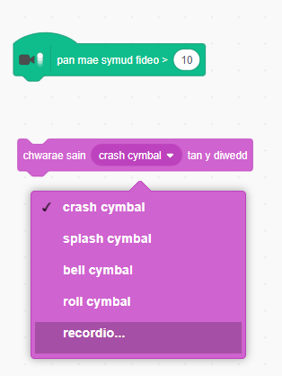

## Her: gwella dy fand

Defnyddia yr hyn rwyt ti wedi ei ddysgu yn y prosiect yma i wneud dy fand dy hunan! Galli di greu unrhyw offerynau - edrycha ar y synau ac offerynau i gael rhai syniadau.



```blocks3
when this sprite clicked
set instrument to (\(1\) Piano v)
play note (60) for (0.25) beats
```

Does dim rhaid i dy offerynau fod yn rhai call cofia. Er enghraifft, galli di wneud piano yn defnyddio myffins!


Yn ogystal â chorluniau sy'n bodoli yn barod, mae modd i ti baentio rhai dy hunan!



--- collapse ---
---
title: Pam bod fy nghorlun yn 'neidio' pan mae'n newid gwisg?
---
Pan wyt ti'n creu dy gorlun dy hunan, mae'n bosib nei di weld pan wyt ti'n clicio'r corlun ei fod yn 'neidio' o gwmpas wrth iddo newid gwisg. Mae hyn gan nad yw'r ddau wisg wedi eu canoli yn yr un lle.

I ddatrys hyn, gwna'n siwr fod canolbwynt gwisg dy gorlun yr un peth.

--- /collapse ---

Os oes meicroffôn gyda ti, alli di recordio dy sain dy hunan ac mae modd defnyddio gwe-gamera i daro dy offerynnau!


