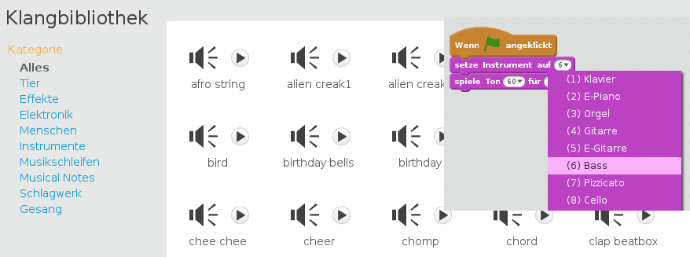
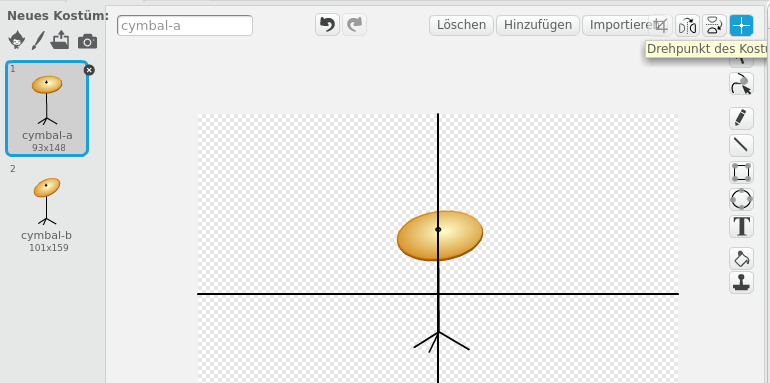

--- challenge ---

## Herausforderung: Mache deine eigene Band

Nutze, was du in diesem Projekt gelernt hast, um deine eigene Band zu gründen! Du kannst beliebige Instrumente erstellen - schau dir die verfügbaren Klänge und Instrumente an, um einige Ideen zu erhalten.

Deine Instrumente müssen jedoch nicht vernünftig sein. Du könntest zum Beispiel ein Piano aus Muffins machen!

Du kannst nicht nur vorhandene Figuren verwenden, sondern auch eigene zeichnen.

--- collapse ---
---
title: Warum springt mein Sprite, wenn er das Kostüm wechselt?
---

+ Wenn du eine eigene Figur erstellst, kann es dir vielleicht passieren, dass die Figur beim anklicken "springt", wenn sie das Kostüm wechselt. Dies liegt daran, dass die beiden Kostüme nicht an derselben Stelle zentriert sind.

Um das Problem zu beheben, klicke für beide Kostüme auf **Drehpunkt des Kostüms**, und stelle sicher, dass das Zentrum in beiden Kostümen an der gleichen Stelle ist.

--- /collapse ---

Wenn du ein Mikrofon hast, kannst du deine eigenen Klänge aufnehmen oder sogar eine Webcam benutzen, um deine Instrumente zu spielen!

--- /challenge ---