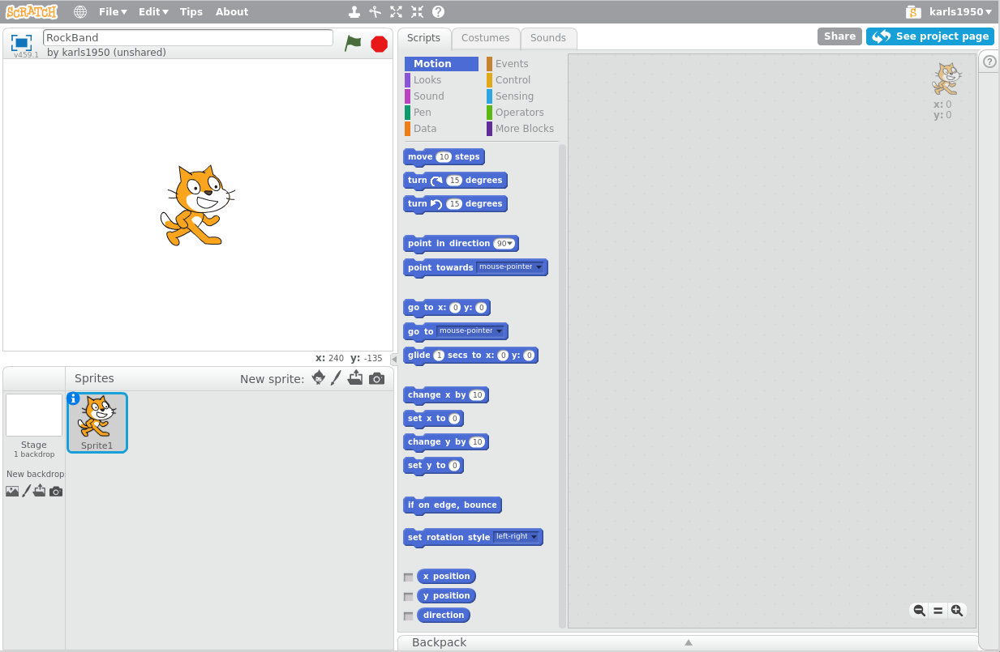
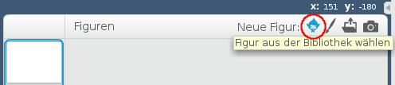
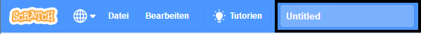
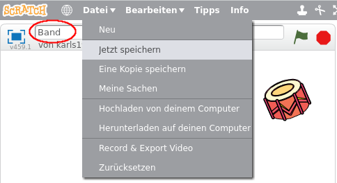

## Figuren

Bevor du mit dem Programmieren beginnen kannst, musst du ein "Ding" zum Programmieren hinzufügen. In Scratch heißen diese "Dinge" **Figur**.

--- task --- Öffne ein neues Scratch-Projekt.

**Online:** öffne ein neues Online-Scratch-Projekt über [rpf.io/scratch-new](http://rpf.io/scratch-new){:target="_blank"}.

**Offline:** öffne ein neues Projekt im Offline-Editor.

Wenn du Scratch herunterladen und auf deinem Rechner installieren möchtest, dann findest du die Datei unter diesem Link: [rpf.io/scratchoff](http://rpf.io/scratchoff){:target="_blank"}.

Es sieht so aus:

 --- /task --- --- task --- Die Katzen-Figur die du siehst ist das Scratch-Maskottchen. Du brauchst sie für dieses Spiel nicht, also entferne sie indem du mit der rechten Maustaste draufklickst und dann auf **Löschen** klickst.

 --- /task ---

--- task --- Als Nächstes klicke auf **Figur aus der Bibliothek wählen** um eine Liste aller Scratch-Figuren zu öffnen.

 --- /task ---

--- task --- Scrolle nach unten, bis du die Trommeln siehst. Klicke auf eine Trommel um sie deinem Projekt hinzuzufügen.

--- /task ---

--- task ---

Klicke auf die Trommel und ziehe sie an den unteren Rand der Bühne.

--- /task ---

--- task --- Gib deinem Programm einen Namen, indem du ihn in das Textfeld oben eingibst.

Um dein Projekt zu speichern, klickst du auf **Datei** und dann auf **Jetzt speichern**.

Wenn du nicht online bist oder kein Scratch-Konto hast, kannst du eine Kopie deines Projekts speichern, indem du auf **Herunterladen auf deinen Computer** klickst.

 --- /task ---