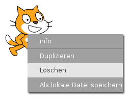
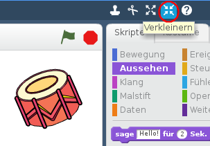

## Figuren

Bevor du mit dem Programmieren beginnen kannst, musst du ein "Ding" zum Programmieren hinzufügen. In Scratch heißen diese "Dinge" **Figur**.

+ Öffne zuerst den Scratch-Editor. Du findest den Online-Scratch-Editor unter <a href="http://jumpto.cc/scratch-new" target="_blank">jumpto.cc/scratch-new</a>. Er sieht etwa so aus:
    
    

+ Die Katzen-Figur, die du siehst, ist das Scratch-Maskottchen. Um sie los zu werden, klicke mit der rechten Maustaste darauf und klicke dann auf **Löschen**.
    
    

+ Als Nächstes klicke auf **Figur aus der Bibliothek wählen** um eine Liste aller Scratch-Figuren zu öffnen.
    
    

+ Scrolle nach unten, bis du die Trommeln siehst. Klicke auf eine und klicke dann auf **OK** um sie zu deinem Projekt hinzu zu fügen.
    
    

+ Klicke auf **Verkleinern** und klicke dann mehrmals auf die Trommel, um sie zu verkleinern.
    
    

Gib deinem Programm einen Namen, indem du ihn in das Textfeld in der oberen linken Ecke eingibst.

Um dein Projekt zu speichern, klickst du auf **Datei** und dann auf **Jetzt speichern**. Wenn du kein Scratch-Konto hast, kannst du eine Kopie deines Projekts speichern, indem du auf Datei und dann auf **Herunterladen auf deinen Computer** klickst.

