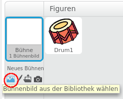
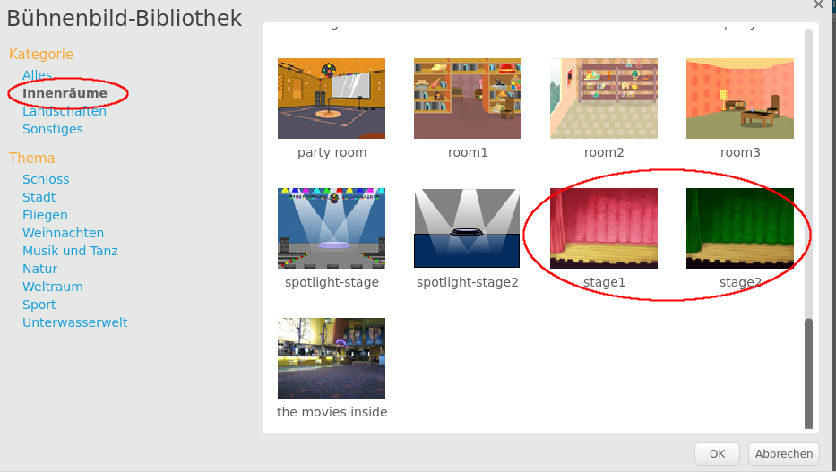

## Die Bühne

Die **Bühne** ist der Bereich auf der rechten Seite, und dort wird dein Projekt zum Leben erweckt. Betrachte es als den Bereich des Auftritts, genau wie eine echte Bühne!

\--- task \--- Momentan ist die Bühne weiß und sieht ziemlich langweilig aus! Füge ein Bühnenbild hinzu, indem du auf **Bühnenbild wählen** klickst.

 \--- /task \---

\--- task \--- Klicke auf **Innenräume** in der Liste oben. Klicken Sie dann auf ein Theater-Bild.

 \--- /task \---

\--- task \--- Deine Bühne sollte nun so ähnlich aussehen wie das hier:

 \--- /task \---