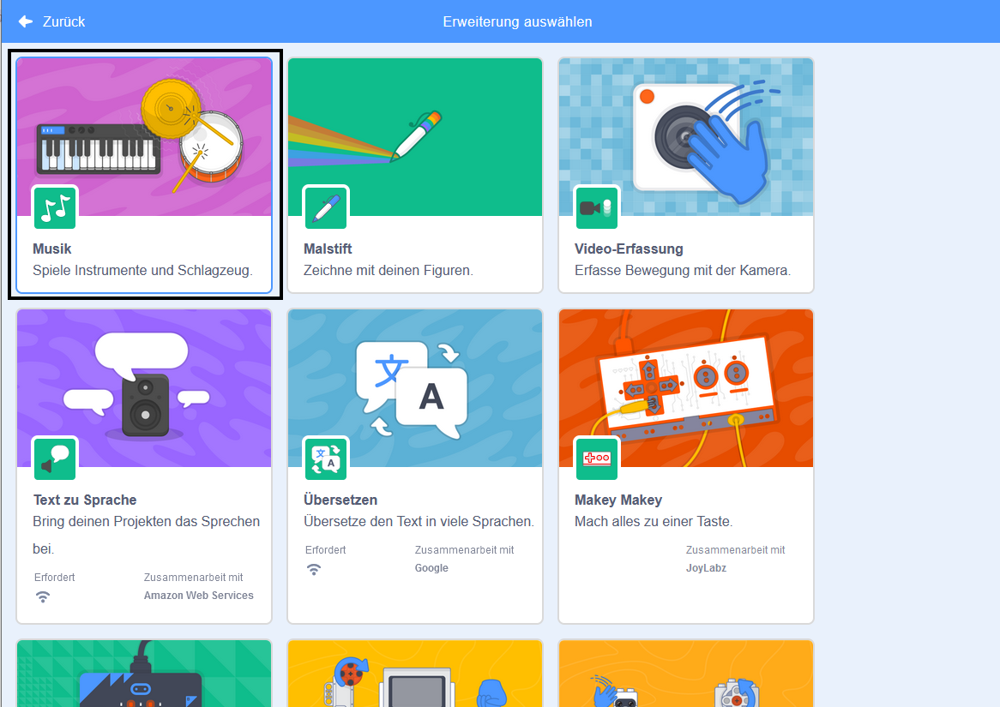
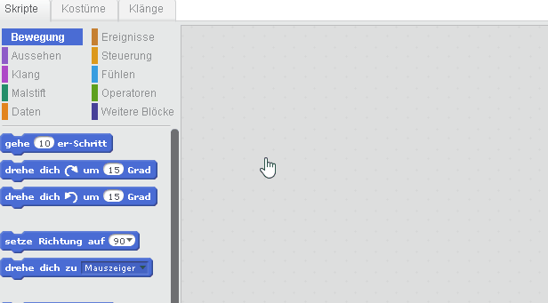

## Eine Trommel machen

Jetzt wirst du Code zu deiner Trommel hinzufügen, so dass die Trommel ein Geräusch macht wenn sie angeklickt wird.

Du findest die Codeblöcke auf der Registerkarte "Skripte" und sie sind alle farbcodiert!

--- task ---

Füge zuerst die **Musik** Erweiterung hinzu damit du Instrumente spielen kannst.

Klicken Sie auf die Schaltfläche **Erweiterung hinzufügen** in der unteren linken Ecke.


Klicken Sie auf die Erweiterung **Musik**, um sie hinzuzufügen.



--- /task ---

--- task --- Klicke auf die Trommel und ziehe dann diese beiden Blöcke in den Code-Bereich-Bereich rechts:

--- no-print ---



--- /no-print ---

--- print-only ---

```blocks3
Wenn diese Figur angeklickt wird
spiele Schlaginstrument (\(1\) Snare Drum v) für (0.25) Schläge
```

--- /print-only ---

Achte darauf, dass die Blöcke miteinander verbunden sind (wie LEGO Steine).

--- /task ---

--- task --- Klicke auf die Trommel, um dein neues Instrument auszuprobieren! --- /task ---