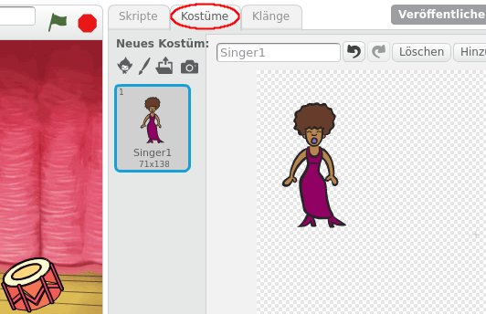

## Eine Sängerin programmieren

Lass uns jetzt eine Sängerin zu unserer Band hinzufügen!

+ Füge 2 weitere Figuren zu deiner Bühne hinzu: eine Sängerin und ein Mikrofon.

	

+ Bevor du deine Sängerin zum Singen bringen kannst, musst du einen Klang zu deiner Figur hinzufügen. Stelle sicher, dass du die Sängerin ausgewählt hast, und klicke auf 'Klänge und dann auf 'Klang aus der Bibliothek wählen':

	

+ Wenn du links auf 'Gesang' klickst, kannst du einen passenden Klang für deine Figur auswählen.

	

+ Weil der Klang jetzt hinzugefügt wurde, kannst du diesen Code zu deiner Sängerin hinzufügen:

	```blocks
		Wenn ich angeklickt werde
		spiele Klang [singer1 v] ganz
	```

+ Klicke auf die Sängerin, um sicherzustellen, dass sie singt, wenn sie geklickt wird.

+ Du kannst auch das Kostüm der Sängerin wechseln, damit man bemerkt, wenn sie singt. Klicke mit der rechten Maustaste auf das Kostüm und wähle 'Duplizieren', damit du genau so wie bei der Trommel eine Kopie hast. Benenne die zwei Kostüme um in 'singt nicht' und 'singt'.

	

+ Zeichne ein paar Linien neben den Mund der Sängerin. Die Sängerin sollte ungefähr so aussehen:

	

+ Füge jetzt diesen Code zu deiner Sängerin hinzu, damit ihr Kostüm wechselt, wenn sie angeklickt wird:

	```blocks
		Wenn die grüne Flagge angeklickt
		wechsle zu Kostüm [singt nicht v]

		Wenn ich angeklickt werde
		wechsle zu Kostüm [singt v]
		spiele Klang [singer1 v] ganz
		wechsle zu Kostüm [singt nicht v]
	```

+ Klicke auf die Sängerin, um zu testen, ob dein neuer Code funktioniert.
