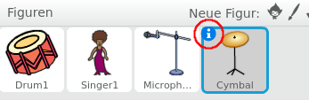

## Ein Becken programmieren

Bisher haben wir für alle Instrumente fertige Bilder aus der Scratch-Bibliothek benutzt. Warum nicht eine eigene Figur zeichnen?

+ Um dein eigenes Bild für das Becken zu zeichnen, klicke auf das 'Neue Figur zeichnen' Symbol mit dem Pinsel.

	

+ Wie du siehst, hast du jetzt eine leere Figur namens 'Figur1'. Zeichne das Becken in 'Kostüm1', indem du eine gelbe Ellipse und ein paar schwarze Linien zeichnest. Du solltest dieses Kostüm auch in 'nicht geschlagen' umbenennen, wie bei den anderen Figuren.

	

+ Dupliziere das Becken-Kostüm, um ein zweites Kostüm zu erstellen, und benenne es um in 'geschlagen'.

+ Damit das Becken so aussieht, als ob es geschlagen wurde, kannst du es drehen. Um das zu tun, klicke auf das 'Auswählen'-Werkzeug und ziehe es, um das Becken zu markieren. Du kannst danach den runden 'Dreh'-Griff ziehen, um das Becken zu drehen.

	

	Die Becken-Kostüme sollten ungefähr so aussehen:

	

+ Das Becken ist wahrscheinlich etwas zu groß. Klicke auf das 'Verkleinern'-Symbol, woraufhin sich der Mauszeiger verändert. Klicke einige Mal auf das Becken, um es zu verkleinern. Du kannst das Becken auch verschieben, um ihm auf der Bühne einen besseren Platz zu geben.

	

+ Als nächstes solltest du den Namen der Figur umändern, weil 'Figur1' kein besonders hilfreicher Name ist! Klicke auf das Symbol für die Becken-Figur und dann auf das blaue `i`{:class="blockmotion"} (Information) oben links.

	

	Du kannst jetzt den Namen der Figur in etwas Sinnvolles, wie 'Becken', umändern!

+ Da die Bilder jetzt fertig sind, kannst du einen Klang zur Becken-Figur hinzufügen. Klicke auf 'Klang aus der Bibliothek wählen', dann auf 'Schlagwerk' und wähle den 'cymbal crash'-Klang.

	

+ Füge diesen Code zum Becken hinzu, so dass es einen Klang von sich gibt und das Kostüm wechselt, wenn es angeklickt wird:

	```blocks
		Wenn die grüne Flagge angeklickt
		wechsle zu Kostüm [not hit v]

		Wenn ich angeklickt werde
		wechsle zu Kostüm [hit v]
		spiele Klang [cymbal crash v] ganz
		wechsle zu Kostüm [not hit v]
	```

+ Teste das Becken, um zu sehen ob es funktioniert!
