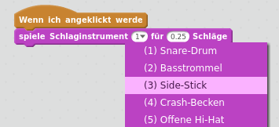
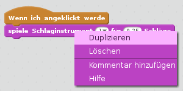

## Herausforderung: Verbessere deine Trommel

Kannst du den Sound ändern, den die Trommel macht, wenn sie angeklickt wird?



Kannst du die Trommel auch dazu bringen ein Geräusch zu machen wenn die Leertaste gedrückt wird? Du musst dieses `Ereignis`{:class="block3events"} verwenden:

```blocks3
when [Leertaste v] key pressed
```

Wenn du deinen vorhandenen Code kopieren möchtest, klicke mit der rechten Maustaste darauf und klicke dann auf **Duplizieren**.

