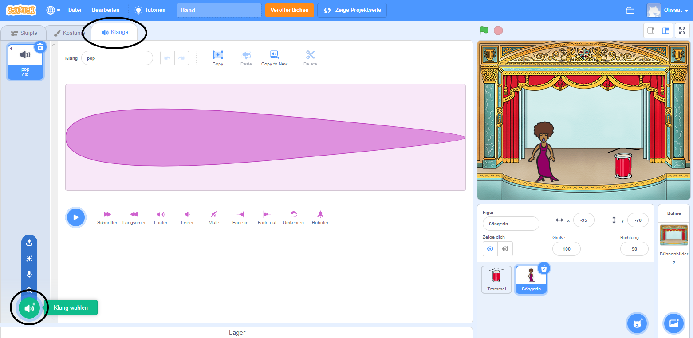
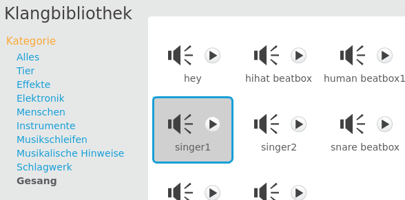

## Einen Sänger machen

Jetzt wirst du eine Sängerin zu deiner Band hinzufügen!

--- task ---

Füge eine Sängerinen-Figur (Singer1) zu deiner Bühne hinzu.


[[[generic-scratch3-sprite-from-library]]]

--- /task ---

--- task ---

Bevor du deine Sängerin zum Singen bringen kannst, musst du deiner Figur einen Klang hinzufügen. Vergewissere dich, dass du deine Sängerin ausgewählt hast, klicke dann auf die Registerkarte Klänge, und klicke dann auf **Klang wählen**:

 --- /task ---

--- task --- Klicke oben in der Liste auf **Stimmen** und wähle dann ein Geräusch um es deiner Figur hinzuzufügen.

 --- /task ---

--- task --- Um den Klang zu verwenden füge die folgenden Codeblöcke zu deiner Sängerinen Figur hinzu:

```blocks3
when this sprite clicked
play sound (singer1 v) until done
```

--- /task ---

--- task --- Klicke auf die Sängerin auf der Bühne und schau was passiert. Singt sie? --- /task ---