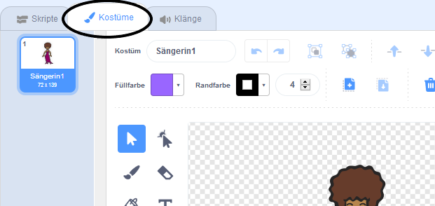
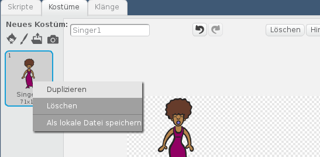
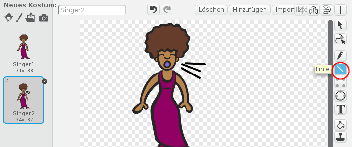
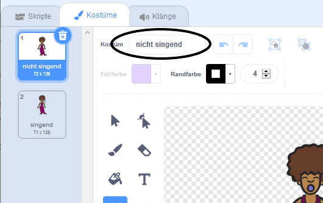

## Kostüme

Jetzt wirst du deine Sängerin aussehen lassen als würde sie singen.

--- task --- Du kannst das Aussehen deiner Sänger-Figur beim darauf klicken ändern, indem du ein neues Kostüm erstellst. Klicke auf den Tab Kostüme und du siehst das Bild der Sängerin.

 --- /task ---

--- task --- Klicke mit der rechten Maustaste auf das Kostüm und klicke dann auf **Duplizieren** um eine Kopie des Kostüms zu erstellen.

 --- /task ---

--- task --- Klicke auf das neue Kostüm ('Singer2' genannt), wähle dann das Werkzeug Linie und zeichne Linien, damit es so aussieht, als ob deine Sängerin ein Geräusch macht.

 --- /task ---

--- task --- Die Namen der Kostüme sind im Moment noch nicht wirklich hilfreich. Tippe in die Textfelder der Kostüme um ihre Namen in "nicht singend" und "singend" zu ändern.

 --- /task ---

--- task --- Jetzt, wo du zwei verschiedene Kostüme für deine Sängerin hast, kannst du wählen, welches Kostüm angezeigt wird! Füge diese zwei Blöcke zu deiner Sängerin hinzu:

```blocks3
when this sprite clicked
+switch costume to (singend v)
play sound (singer1 v) until done
+switch costume to (nicht singend v)
```

Der Codeblock zum Ändern des Kostüms befindet sich im Abschnitt `Aussehen`{:class="block3looks"}. --- /task ---

--- task --- Klicke auf die Sängerin. Sieht sie aus als würde sie singen? --- /task ---

--- task --- Jetzt lass deine Trommel so aussehen als würde sie geschlagen!


- Nutze die Anleitung zum ändern des Kostüms der Sängerin als Hilfestellung.

Denke daran deinen neuen Code zu testen! --- /task ---