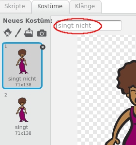
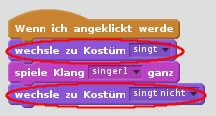

## Kostüme

Lass deine Sängerin aussehen, als würde sie singen!

+ Du kannst das Aussehen deiner Sänger-Figur beim darauf klicken ändern, indem du ein neues Kostüm erstellst. Klicke auf den Tab Kostüme und du sehen das Bild der Sängerin.
    
    

+ Klicke mit der rechten Maustaste auf das Kostüm und klicke auf **Duplizieren** um eine Kopie des Kostüms zu erstellen.
    
    

+ Klicke auf das neue Kostüm ('Singer2' genannt), wähle dann das Linienwerkzeug und zeichne Linien, damit es so aussieht, als ob dein Sänger ein Geräusch macht.
    
    

+ Die Namen der Kostüme sind im Moment nicht sehr hilfreich. Benenne die zwei Kostüme um, so dass sie "singt nicht" und "singt" heißen, indem du den neuen Namen jedes Kostüms in das Textfeld eingibst.
    
    

+ Jetzt, wo du zwei verschiedene Kostüme für deine Sängerin hast, kannst du wählen, welches Kostüm angezeigt wird! Füge diese zwei Blöcke zu deiner Sängerin hinzu:
    
    
    
    Der Codeblock zum Ändern des Kostüms befindet sich im Abschnitt `Aussehen`{:class="blocklooks"}.

+ Klicke auf deine Sängerin. Sieht sie aus, als würde sie singen?