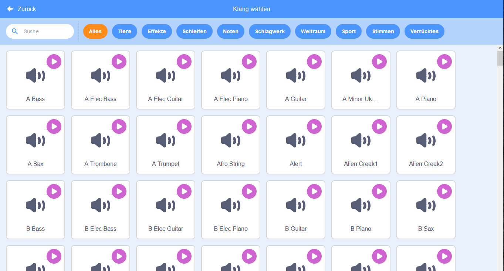
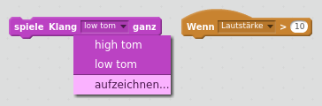

## Herausforderung: Verbessere deine Band

Nutze, was du in diesem Projekt gelernt hast, um deine eigene Band zu erstellen! Du kannst beliebige Instrumente erstellen - schau dir die verfügbaren Klänge und Figuren an, um einige Ideen zu erhalten.



```blocks3
when this sprite clicked
set instrument to (\(1\) Klavier v)
play note (60) for (0.25) beats
```

Deine Instrumente müssen jedoch nicht realistisch sein. Du könntest zum Beispiel ein Piano aus Muffins machen!


Du kannst mehr Figuren aus der Bibliothek verwenden, und du kannst sogar deine eigenen Figuren malen!


--- collapse ---
---
title: Warum springt mein Sprite, wenn er das Kostüm wechselt?
---

Wenn du eine eigene Figur erstellst, kann es dir vielleicht passieren, dass die Figur beim anklicken "springt", wenn sie das Kostüm wechselt. Dies liegt daran, dass die beiden Kostüme nicht an derselben Stelle zentriert sind.

Um das zu beheben, stelle sicher dass deine Figuren Kostüme den selben Mittelpubkt haben.

--- /collapse ---

Wenn du ein Mikrofon hast, kannst du deine eigenen Klänge aufnehmen und sogar eine Webcam benutzen, um deine Instrumente zu spielen!

