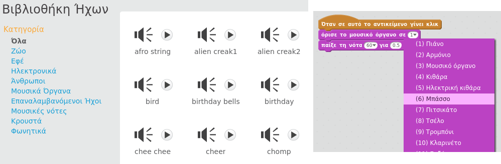
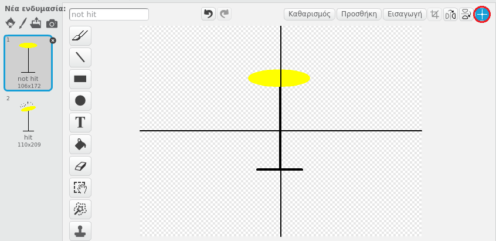

--- challenge ---

## Πρόκληση: δημιούργησε τη δική σου μπάντα

Χρησιμοποίησε αυτά που έχεις μάθει σε αυτό το έργο για να φτιάξεις τη δική σου μπάντα! Μπορείς να δημιουργήσεις όποια όργανα σου αρέσουν - δες τους διαθέσιμους ήχους και τα διαθέσιμα όργανα για να πάρεις μερικές ιδέες.

Ωστόσο, τα όργανά σου δεν χρειάζεται να έχουν λογική. Για παράδειγμα, θα μπορούσες να φτιάξεις ένα πιάνο από κεκάκια!

Εκτός από τη χρήση των υφιστάμενων αντικειμένων, μπορείς επίσης να σχεδιάσεις το δικό σου.

--- collapse ---
---
title: Γιατί αναπηδά το αντικείμενό μου όταν αλλάζει ενδυμασία;
---

+ Όταν δημιουργείς το δικό σου αντικείμενο, μπορεί να διαπιστώσεις ότι όταν κάνεις κλικ πάνω του, αυτό 'αναπηδά' καθώς αλλάζει ενδυμασία. Αυτό συμβαίνει επειδή οι δύο ενδυμασίες δεν είναι στοιχισμένες στο ίδιο μέρος.

Για να το διορθώσεις αυτό, κάνε κλικ στο **Επιλογή κέντρου της ενδυμασίας** και στις δύο ενδυμασίες και βεβαιώσου ότι το κέντρο βρίσκεται στο ίδιο σημείο και στις δύο ενδυμασίες.

--- /collapse ---

Αν έχεις ένα μικρόφωνο, μπορείς να εγγράψεις τους δικούς σου ήχους, ή ακόμα και να χρησιμοποιήσεις μια web κάμερα για να χτυπάς τα όργανά σου!

--- /challenge ---