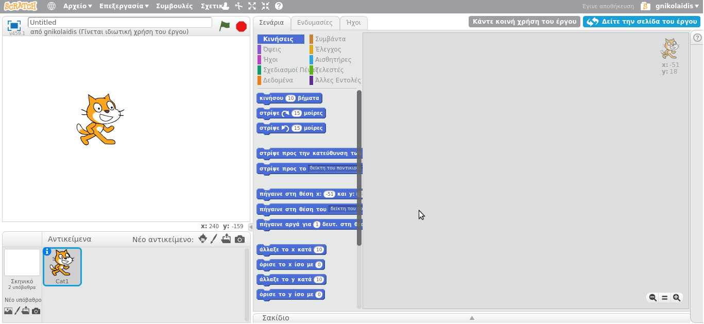
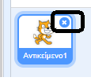
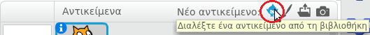
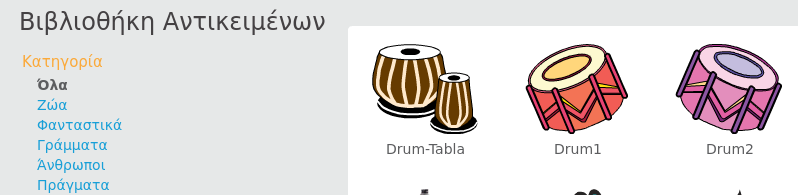
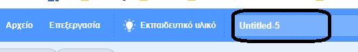
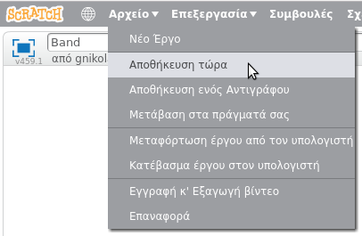

## Χαρακτήρες

Προτού ξεκινήσεις την κωδικοποίηση, θα πρέπει να προσθέσεις ένα "πράγμα" στον κώδικα. Στο Scratch, αυτά τα "πράγματα" ονομάζονται **χαρακτήρες**.

--- task --- Άνοιξε ένα νέο έργο Scratch.

**Online:** άνοιξε ένα νέο έργο Scratch στη διεύθυνση [rpf.io/scratch-new](http://rpf.io/scratch-new){:target="_blank"}.

**Offline:** άνοιξε ένα νέο έργο στον επεξεργαστή εκτός σύνδεσης.

Αν χρειαστεί να κατεβάσεις και να εγκαταστήσεις τον offline editor για το Scratch, μπορείς να το βρεις στο [rpf.io/scratchoff](http://rpf.io/scratchoff){:target="_blank"}.

Δείχνει κάπως έτσι:

 --- /task --- --- task --- Ο χαρακτήρας γάτας που μπορείς να δεις είναι η μασκότ του Scratch. Δεν τον χρειάζεσαι για αυτό το παιχνίδι, οπότε τον αφαιρείς κάνοντας δεξί κλικ και στη συνέχεια κάντε κλικ στη **διαγραφή** .

 --- /task ---

--- task --- Στη συνέχεια, κάνε κλικ στο **Διαλέξτε ένα αντικείμενο από τη βιβλιοθήκη** για να ανοίξεις μια λίστα με όλα τα αντικείμενα του Scratch.

 --- /task ---

--- task --- Κύλισε προς τα κάτω έως ότου δεις ένα αντικείμενο τύμπανο. Κάνε κλικ σε ένα τύμπανο και ξανά κλικ στο OK για να το προσθέσεις στο έργο σου.

--- /task ---

--- task ---

Κάνε κλικ και σύρε το τύμπανο στο κάτω μέρος του σκηνικού.

--- /task ---

--- task --- Δώσε στο πρόγραμμα σου ένα όνομα πληκτρολογώντας το στο πλαίσιο κειμένου στην πάνω πλευρά.

Μπορείς να κάνεις κλικ στο **Αρχείο** και, στη συνέχεια, **Αποθήκευση τώρα** για να αποθηκεύσεις το έργο σου.

Αν δεν έχεις λογαριασμό Scratch, μπορείς εναλλακτικά να αποθηκεύσεις ένα αντίγραφο του έργου σου κάνοντας κλικ στο **Κατέβασμα έργου στον υπολογιστή**.

 --- /task ---