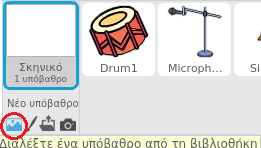
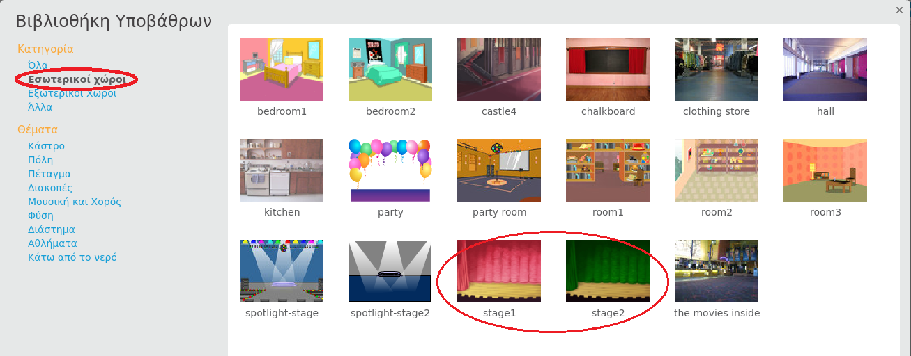

## Το σκηνικό

Το **Σκηνικό** είναι η περιοχή στα αριστερά και είναι εκεί που ζωντανεύει το έργο σου. Σκέψου το ως ένα χώρο εκδηλώσεων, ακριβώς όπως μια πραγματική σκηνή!

\--- task \--- Αυτή τη στιγμή, η σκηνή είναι άσπρη και φαίνεται αρκετά βαρετή! Πρόσθεσε ένα σκηνικό σε αυτό κάνοντας κλικ στο ** Επίλεξε ένα σκηνικό ** .

 \--- /task \---

\--- task \--- Κάνε κλικ στο **Indoors** στη λίστα στην κορυφή. Στη συνέχεια, κάνε κλικ στο φόντο θεάτρου.

 \--- /task \---

\--- task \--- Η σκηνή σου θα πρέπει τώρα να μοιάζει με αυτή:

 \--- /task \---