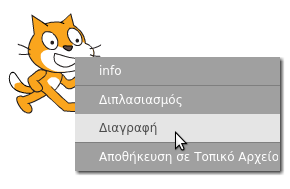
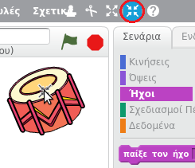

## Αντικείμενα

Προτού ξεκινήσεις την κωδικοποίηση, θα πρέπει να προσθέσεις ένα "πράγμα" στον κώδικα. Στο Scratch, αυτά τα "πράγματα" ονομάζονται **αντικείμενα**.

+ Αρχικά, άνοιξε το πρόγραμμα επεξεργασίας Scratch. Μπορείς να βρεις την οnline εφαρμογή Scratch στο <a href="http://jumpto.cc/scratch-new" target="_blank">jumpto.cc/scratch-new</a>. Μοιάζει με αυτό:
    
    

+ Το αντικείμενο γάτα που βλέπεις είναι η μασκότ του Scratch. Ας απαλλαγούμε από αυτό κάνοντας δεξί κλικ και μετά πατώντας **διαγραφή**.
    
    

+ Στη συνέχεια, κάνε κλικ στο **Διαλέξτε ένα αντικείμενο από τη βιβλιοθήκη** για να ανοίξεις μια λίστα με όλα τα αντικείμενα του Scratch.
    
    

+ Κύλισε προς τα κάτω έως ότου δεις ένα αντικείμενο τύμπανο. Κάνε κλικ σε ένα τύμπανο και ξανά κλικ στο **OK** για να το προσθέσεις στο έργο σου.
    
    

+ Κάνε κλικ στο εικονίδιο **συμπύκνωση** και στη συνέχεια κάνε κλικ στο τύμπανο μερικές φορές για να το κάνεις μικρότερο.
    
    

Δώσε στο πρόγραμμα ένα όνομα πληκτρολογώντας στο πλαίσιο κειμένου στην επάνω αριστερή γωνία.

Στη συνέχεια, μπορείς να κάνεις κλικ στο **Αρχείο** και μετά στο **Αποθήκευση τώρα** για να αποθηκεύσεις το έργο σου. Αν δεν έχεις λογαριασμό Scratch, μπορείς εναλλακτικά να αποθηκεύσεις ένα αντίγραφο του έργου σου κάνοντας κλικ στο **Κατέβασμα έργου στον υπολογιστή**.

