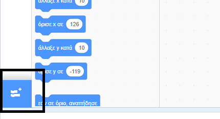
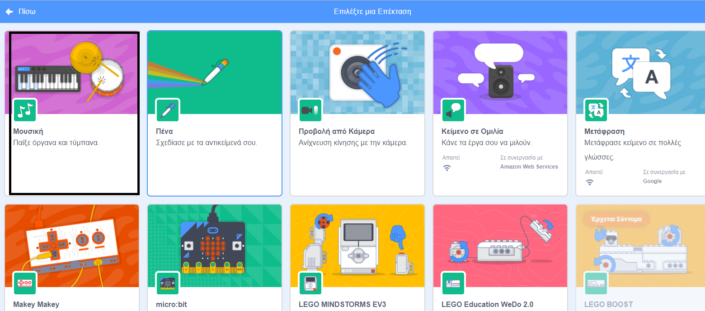
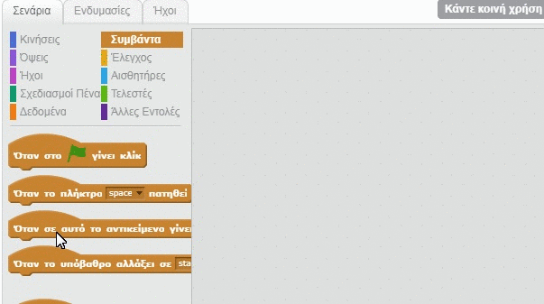

## Φτιάχνοντας ένα τύμπανο

Τώρα, θα προσθέσεις κώδικα στο τύμπανο σου, έτσι ώστε να κάνει έναν ήχο όταν είναι πατημένο.

Μπορείς να βρεις τα μπλοκ κώδικα στην καρτέλα Σενάρια και είναι όλα χρωματιστά!

\--- task --

Πρόσθεσε πρώτα την επέκταση **μουσική** ώστε να μπορείς να παίξεις μουσικά όργανα.

Κάνε κλικ στην **Προσθήκη επέκτασης** στην κάτω αριστερή γωνία.



Κάνε κλικ στην επέκταση **Μουσική** για να την προσθέσεις.



\--- /task \---

\--- task \---

Click on the drum sprite, and then drag these two blocks into the code area on the right:

```blocks3
όταν γίνει κλικ σε αυτό το αντικείμενο
παίξε τύμπανο (\(1\) Snare Drum v) για (0.25) χτύπους
```

\--- no-print \---



\--- /no-print \---

Make sure that the blocks are connected together (like LEGO bricks).

\--- /task \---

\--- task \---

Click on the drum to try out your new instrument!

\--- /task \---